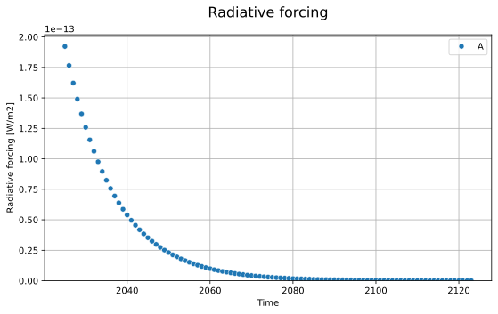
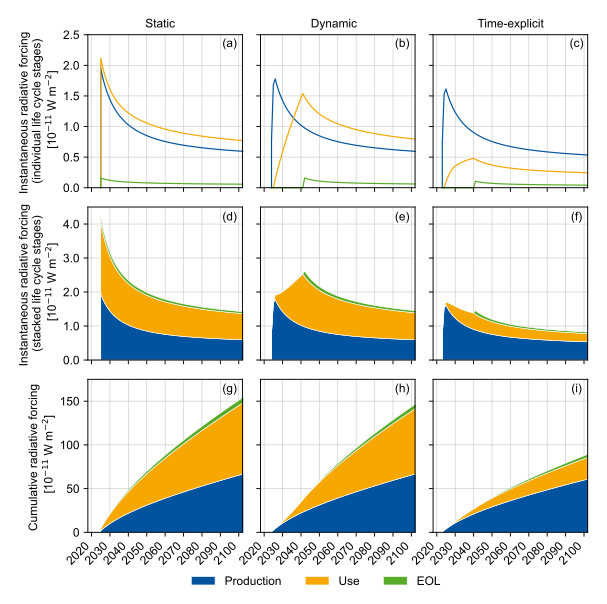

---
tags:
  - example
---

# Example Collection

Here are some examples on how you can use `bw_timex`.

-   **🚗⚡ Life Cycle of an Electric Car**

    ---

    Example of a time-explicit LCA of the entire life cycle of an electric car.

    
    

    [:material-arrow-right: View Example](./example_electric_vehicle_premise_simple.md)

    *by @TimoDiepers*

-   **🚗🔍 Life Cycle of an Electric Car (in detail)**

    ---

    Same case study, but with all the modelling steps and the additional options of `bw_timex` spelled out.

    
    

    [:material-arrow-right: View Example](./example_electric_vehicle_premise.md)

    *by @TimoDiepers*

-   **🌿📈 Dynamic Characterization**

    ---

    Example of some of the dynamic characterization capabilities that come with a TimexLCA.

    

    [:material-arrow-right: View Example](./example_simple_dynamic_characterization.md)

    *by @muelleram*

-   **📄🚗 EV Case Study for our paper**

    ---

    This is the notebook used to calculate the time-explicit LCAs and create the Figures for our paper on time-explicit LCA.

    

    [:material-arrow-right: View Example](./paper_case_study.md)

    *by @TimoDiepers*

-   **📁💻 Import foreground system from Excel**

    ---

    This notebook shows how to import your modelled product system from an Excel file.

    

    [:material-arrow-right: View Example](./example_Importing_model_from_excel.md)

    *by @jakobsarthur & @muelleram*

-   **Or do you have anything to add? 🧐**

    ---

    Please contact us if you want to share your super cool example!

    *by @You?*

