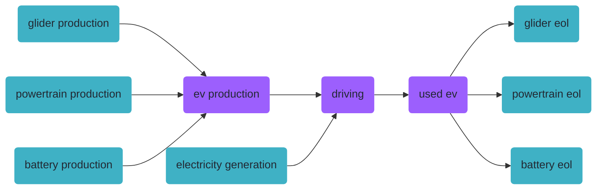
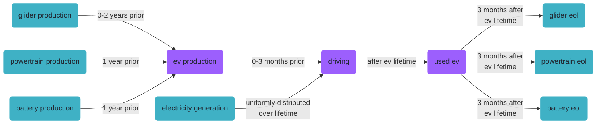
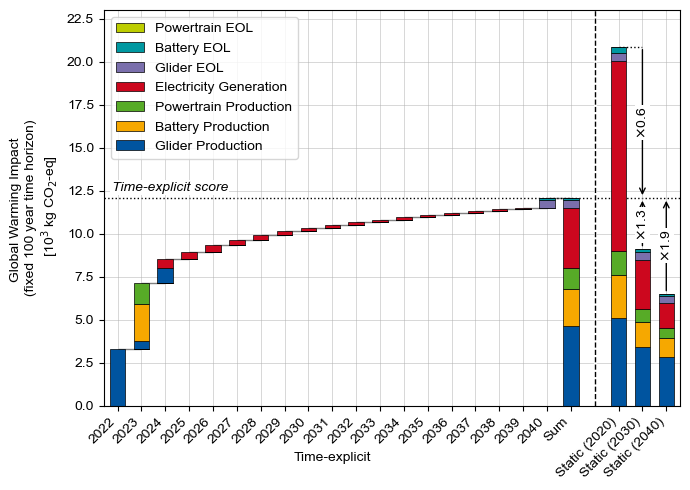
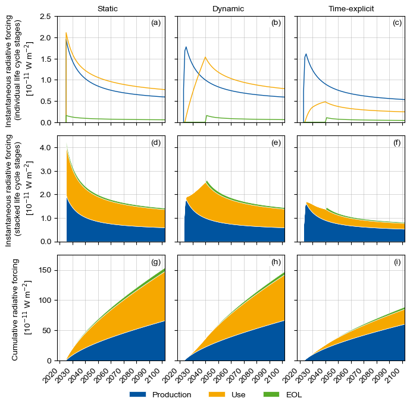

<div hidden data-source-edit-path="docs/content/examples/paper_case_study.ipynb" data-source-view-path="docs/content/examples/paper_case_study.ipynb"></div>
# Time-explicit LCA of an electric vehicle


This notebook contains the code for the exemplary case study of out paper on time-explicit LCA. Here, we do a time-explicit LCA of the life cycle of an electric vehicle (EV) and compare the results to the results from static and dynamic LCAs.


```python { .notebook-cell }
import bw2data as bd

bd.projects.set_current("timex")
```

## Case study setup

### Database setup


First, we set up the databases we need, starting with a new empty foreground database:


```python { .notebook-cell }
if "foreground" in bd.databases:
    del bd.databases["foreground"]  # to make sure we create the foreground from scratch
foreground = bd.Database("foreground")
foreground.register()
```

Next, we load our prospective background databases. In this study, we use data from [ecoinvent v3.10](https://ecoinvent.org/), and create a set of prospective databases with [`premise`](https://github.com/polca/premise). We applied projections for the future electricity sectors using the SSP2-RCP19 pathway from the IAM IMAGE.
In the [premise documentation](https://premise.readthedocs.io/en/latest/) you can find instructions for the creation of prospective background databases.


```python { .notebook-cell }
db_2020 = bd.Database("ei310_IMAGE_SSP2_RCP19_2020_electricity")
db_2030 = bd.Database("ei310_IMAGE_SSP2_RCP19_2030_electricity")
db_2040 = bd.Database("ei310_IMAGE_SSP2_RCP19_2040_electricity")
```

### Modeling the production system


In this study, we consider the following production system for the EV. Purple boxes are foreground, cyan boxes are background (i.e., ecoinvent/premise).





For our EV model, we make the following assumptions:


```python { .notebook-cell }
LIFETIME = 16  # years
MILEAGE = 150_000  # km
ELECTRICITY_CONSUMPTION = 0.2  # kWh/km

# Overall mass: 1200 kg
MASS_GLIDER = 840  # kg
MASS_POWERTRAIN = 80  # kg
MASS_BATTERY = 280  # kg
```

Now, we create the foreground processes:


```python { .notebook-cell }
ev_production = foreground.new_node(
    "ev_production", name="production of an electric vehicle", unit="unit"
)
ev_production["reference product"] = "electric vehicle"
ev_production.save()

driving = foreground.new_node(
    "driving", name="driving an electric vehicle", unit="transport over an ev lifetime"
)
driving["reference product"] = "transport"
driving.save()

used_ev = foreground.new_node("used_ev", name="used electric vehicle", unit="unit")
used_ev["reference product"] = "used electric vehicle"
used_ev.save()
```

We take the actual process data from ecoinvent. However, the ecoinvent processes for the EV part production contain intermediate flows for the end of life treatment in the production processes already, which we want to separate. We fix this first by creating new processes without the EOL:


```python { .notebook-cell }
for db in [db_2020, db_2030, db_2040]:
    for code in [
        "glider_production_without_eol",
        "powertrain_production_without_eol",
        "battery_production_without_eol",
    ]:
        try:
            act = db.get(code=code)
            act.delete()
        except:
            pass

    glider_production = db.get(name="glider production, passenger car")
    glider_production_without_eol = glider_production.copy(
        code="glider_production_without_eol", database=db.name
    )
    glider_production_without_eol["name"] = (
        "glider production, passenger car, without EOL"
    )
    glider_production_without_eol.save()
    for exc in glider_production_without_eol.exchanges():
        if exc.input["name"] == "market for used glider, passenger car":
            exc.delete()

    powertrain_production = db.get(
        name="powertrain production, for electric passenger car"
    )
    powertrain_production_without_eol = powertrain_production.copy(
        code="powertrain_production_without_eol", database=db.name
    )
    powertrain_production_without_eol["name"] = (
        "powertrain production, for electric passenger car, without EOL"
    )
    powertrain_production_without_eol.save()
    for exc in powertrain_production_without_eol.exchanges():
        if (
            exc.input["name"]
            == "market for used powertrain from electric passenger car, manual dismantling"
        ):
            exc.delete()

    battery_production = db.get(
        name="battery production, Li-ion, LiMn2O4, rechargeable, prismatic"
    )
    battery_production_without_eol = battery_production.copy(
        code="battery_production_without_eol", database=db.name
    )
    battery_production_without_eol["name"] = (
        "battery production, Li-ion, LiMn2O4, rechargeable, prismatic, without EOL"
    )
    battery_production_without_eol.save()
    # For the battery, some waste treatment is buried in the process "battery cell production, Li-ion,
    # LiMn2O4" - but not for the whole mass of the battery(?). For simplicity, we just leave it in there.
```

Now, we add the intermediate flows, starting with the EV production:


```python { .notebook-cell }
glider_production = db_2020.get(code="glider_production_without_eol")
powertrain_production = db_2020.get(code="powertrain_production_without_eol")
battery_production = db_2020.get(code="battery_production_without_eol")

ev_production.new_edge(input=ev_production, amount=1, type="production").save()

glider_to_ev = ev_production.new_edge(
    input=glider_production, amount=MASS_GLIDER, type="technosphere"
)
powertrain_to_ev = ev_production.new_edge(
    input=powertrain_production, amount=MASS_POWERTRAIN, type="technosphere"
)
battery_to_ev = ev_production.new_edge(
    input=battery_production, amount=MASS_BATTERY, type="technosphere"
)
```

... the EOL:


```python { .notebook-cell }
glider_eol = db_2020.get(name="treatment of used glider, passenger car, shredding")
powertrain_eol = db_2020.get(
    name="treatment of used powertrain for electric passenger car, manual dismantling"
)
battery_eol = db_2020.get(name="market for used Li-ion battery")

used_ev.new_edge(
    input=used_ev, amount=-1, type="production"
).save()  # -1 as this gets rid of a used car

used_ev_to_glider_eol = used_ev.new_edge(
    input=glider_eol,
    amount=-MASS_GLIDER,
    type="technosphere",
)
used_ev_to_powertrain_eol = used_ev.new_edge(
    input=powertrain_eol,
    amount=-MASS_POWERTRAIN,
    type="technosphere",
)
used_ev_to_battery_eol = used_ev.new_edge(
    input=battery_eol,
    amount=-MASS_BATTERY,
    type="technosphere",
)
```

...and, finally, driving:


```python { .notebook-cell }
electricity_production = db_2020.get(
    name="market group for electricity, low voltage", location="WEU"
)

driving.new_edge(input=driving, amount=1, type="production").save()

driving_to_used_ev = driving.new_edge(input=used_ev, amount=-1, type="technosphere")
ev_to_driving = driving.new_edge(input=ev_production, amount=1, type="technosphere")
electricity_to_driving = driving.new_edge(
    input=electricity_production,
    amount=ELECTRICITY_CONSUMPTION * MILEAGE,
    type="technosphere",
)
```


```python { .notebook-cell }
glider_to_ev.save()
powertrain_to_ev.save()
battery_to_ev.save()
ev_to_driving.save()
electricity_to_driving.save()
driving_to_used_ev.save()
used_ev_to_glider_eol.save()
used_ev_to_powertrain_eol.save()
used_ev_to_battery_eol.save()
```

To allow a comparison with a static LCA later, we calculate the radiative forcing results at this point, before temporalization:


```python { .notebook-cell }
from datetime import datetime
from bw_timex import TimexLCA

method = ("EF v3.1", "climate change", "global warming potential (GWP100)")

database_dates_dlca = {
    db_2020.name: datetime.strptime("2020", "%Y"),
    "foreground": "dynamic",  # flag databases that should be temporally distributed with "dynamic"
}
dlca_no_tds = TimexLCA({driving: 1}, method, database_dates_dlca)
dlca_no_tds.build_timeline(starting_datetime="2024-01-01", temporal_grouping="month")
dlca_no_tds.lci()
dlca_no_tds.dynamic_lcia(metric="radiative_forcing")
```

    /Users/timodiepers/anaconda3/envs/timex/lib/python3.11/site-packages/scikits/umfpack/umfpack.py:736: UmfpackWarning: (almost) singular matrix! (estimated cond. number: 3.13e+13)
      warnings.warn(msg, UmfpackWarning)
    2025-02-07 10:18:19.799 | INFO     | bw_timex.timex_lca:build_timeline:216 - No edge filter function provided. Skipping all edges in background databases.


    Starting graph traversal


    2025-02-07 10:18:23.932 | INFO     | bw_timex.timeline_builder:get_weights_for_interpolation_between_nearest_years:522 - Reference date 2024-01-01 00:00:00 is higher than all provided dates. Data will be taken from the closest lower year.
    2025-02-07 10:18:23.933 | INFO     | bw_timex.timeline_builder:get_weights_for_interpolation_between_nearest_years:522 - Reference date 2024-01-01 00:00:00 is higher than all provided dates. Data will be taken from the closest lower year.
    2025-02-07 10:18:23.933 | INFO     | bw_timex.timeline_builder:get_weights_for_interpolation_between_nearest_years:522 - Reference date 2024-01-01 00:00:00 is higher than all provided dates. Data will be taken from the closest lower year.
    2025-02-07 10:18:23.933 | INFO     | bw_timex.timeline_builder:get_weights_for_interpolation_between_nearest_years:522 - Reference date 2024-01-01 00:00:00 is higher than all provided dates. Data will be taken from the closest lower year.
    2025-02-07 10:18:23.934 | INFO     | bw_timex.timeline_builder:get_weights_for_interpolation_between_nearest_years:522 - Reference date 2024-01-01 00:00:00 is higher than all provided dates. Data will be taken from the closest lower year.
    2025-02-07 10:18:23.934 | INFO     | bw_timex.timeline_builder:get_weights_for_interpolation_between_nearest_years:522 - Reference date 2024-01-01 00:00:00 is higher than all provided dates. Data will be taken from the closest lower year.
    2025-02-07 10:18:23.934 | INFO     | bw_timex.timeline_builder:get_weights_for_interpolation_between_nearest_years:522 - Reference date 2024-01-01 00:00:00 is higher than all provided dates. Data will be taken from the closest lower year.
    2025-02-07 10:18:23.934 | INFO     | bw_timex.timeline_builder:get_weights_for_interpolation_between_nearest_years:522 - Reference date 2024-01-01 00:00:00 is higher than all provided dates. Data will be taken from the closest lower year.
    2025-02-07 10:18:23.934 | INFO     | bw_timex.timeline_builder:get_weights_for_interpolation_between_nearest_years:522 - Reference date 2024-01-01 00:00:00 is higher than all provided dates. Data will be taken from the closest lower year.
    2025-02-07 10:18:23.935 | INFO     | bw_timex.timeline_builder:get_weights_for_interpolation_between_nearest_years:522 - Reference date 2024-01-01 00:00:00 is higher than all provided dates. Data will be taken from the closest lower year.


    Calculation count: 9


    /Users/timodiepers/anaconda3/envs/timex/lib/python3.11/site-packages/bw2calc/lca_base.py:127: SparseEfficiencyWarning: splu converted its input to CSC format
      self.solver = factorized(self.technosphere_matrix)
    /Users/timodiepers/anaconda3/envs/timex/lib/python3.11/site-packages/scikits/umfpack/umfpack.py:736: UmfpackWarning: (almost) singular matrix! (estimated cond. number: 1.86e+12)
      warnings.warn(msg, UmfpackWarning)
    /Users/timodiepers/anaconda3/envs/timex/lib/python3.11/site-packages/scikits/umfpack/umfpack.py:736: UmfpackWarning: (almost) singular matrix! (estimated cond. number: 1.86e+12)
      warnings.warn(msg, UmfpackWarning)
    /Users/timodiepers/anaconda3/envs/timex/lib/python3.11/site-packages/dynamic_characterization/dynamic_characterization.py:81: UserWarning: No custom dynamic characterization functions provided. Using default dynamic characterization functions.                The flows that are characterized are based on the selection of the initially chosen impact category.                You can look up the mapping in the bw_timex.dynamic_characterizer.characterization_functions.
      warnings.warn(


<table>
  <thead>
    <tr style="text-align: right;">
      <th></th>
      <th>date</th>
      <th>amount</th>
      <th>flow</th>
      <th>activity</th>
    </tr>
  </thead>
  <tbody>
    <tr>
      <th>0</th>
      <td>2024-12-31 05:49:12</td>
      <td>-4.771888e-17</td>
      <td>3269</td>
      <td>109673</td>
    </tr>
    <tr>
      <th>1</th>
      <td>2024-12-31 05:49:12</td>
      <td>-1.887051e-17</td>
      <td>3269</td>
      <td>109674</td>
    </tr>
    <tr>
      <th>2</th>
      <td>2024-12-31 05:49:12</td>
      <td>-6.949656e-18</td>
      <td>3211</td>
      <td>109669</td>
    </tr>
    <tr>
      <th>3</th>
      <td>2024-12-31 05:49:12</td>
      <td>-4.256251e-18</td>
      <td>3269</td>
      <td>109675</td>
    </tr>
    <tr>
      <th>4</th>
      <td>2024-12-31 05:49:12</td>
      <td>-4.007917e-18</td>
      <td>3211</td>
      <td>109673</td>
    </tr>
    <tr>
      <th>...</th>
      <td>...</td>
      <td>...</td>
      <td>...</td>
      <td>...</td>
    </tr>
    <tr>
      <th>37204</th>
      <td>2123-01-01 00:10:48</td>
      <td>5.735388e-13</td>
      <td>107</td>
      <td>109669</td>
    </tr>
    <tr>
      <th>37205</th>
      <td>2123-01-01 00:10:48</td>
      <td>9.472615e-13</td>
      <td>1034</td>
      <td>109673</td>
    </tr>
    <tr>
      <th>37206</th>
      <td>2123-01-01 00:10:48</td>
      <td>1.051160e-12</td>
      <td>1031</td>
      <td>109675</td>
    </tr>
    <tr>
      <th>37207</th>
      <td>2123-01-01 00:10:48</td>
      <td>1.773673e-12</td>
      <td>1031</td>
      <td>109673</td>
    </tr>
    <tr>
      <th>37208</th>
      <td>2123-01-01 00:10:48</td>
      <td>6.377169e-12</td>
      <td>1031</td>
      <td>109669</td>
    </tr>
  </tbody>
</table>
<p>37209 rows × 4 columns</p>
</div>


### Adding temporal distributions


Now that the production system is modelled, we can add temporal distributions at the intermediate flow level. The temporal information we want to embed in our product system looks like this:



To include this temopral information, we use the `TemporalDistribution` class from `bw_temporalis`. For more info, take a look at the [bw_temporalis documentation](https://github.com/brightway-lca/bw_temporalis).


Now we create the relative `TemporalDistribution` objects:


```python { .notebook-cell }
from bw_temporalis import TemporalDistribution, easy_timedelta_distribution
import numpy as np

td_assembly_and_delivery = TemporalDistribution(
    date=np.array([-3, -2], dtype="timedelta64[M]"), amount=np.array([0.2, 0.8])
)

td_glider_production = TemporalDistribution(
    date=np.array([-2, -1, 0], dtype="timedelta64[Y]"), amount=np.array([0.7, 0.1, 0.2])
)

td_produce_powertrain_and_battery = TemporalDistribution(
    date=np.array([-1], dtype="timedelta64[Y]"), amount=np.array([1])
)

td_use_phase = easy_timedelta_distribution(
    start=0,
    end=LIFETIME - 1,  # boundaries are inclusive
    resolution="Y",
    steps=LIFETIME,
    kind="uniform",  # you can also do "normal" or "triangular" distributions
)

td_disassemble_used_ev = TemporalDistribution(
    date=np.array([LIFETIME], dtype="timedelta64[Y]"), amount=np.array([1])
)

td_treating_waste = TemporalDistribution(
    date=np.array([3], dtype="timedelta64[M]"), amount=np.array([1])
)
```

We now add the rTDs to the intermediate flows of our EV system.


```python { .notebook-cell }
glider_to_ev["temporal_distribution"] = td_glider_production
glider_to_ev.save()

powertrain_to_ev["temporal_distribution"] = td_produce_powertrain_and_battery
powertrain_to_ev.save()

battery_to_ev["temporal_distribution"] = td_produce_powertrain_and_battery
battery_to_ev.save()

ev_to_driving["temporal_distribution"] = td_assembly_and_delivery
ev_to_driving.save()

electricity_to_driving["temporal_distribution"] = td_use_phase
electricity_to_driving.save()

driving_to_used_ev["temporal_distribution"] = td_disassemble_used_ev
driving_to_used_ev.save()

used_ev_to_glider_eol["temporal_distribution"] = td_treating_waste
used_ev_to_glider_eol.save()

used_ev_to_powertrain_eol["temporal_distribution"] = td_treating_waste
used_ev_to_powertrain_eol.save()

used_ev_to_battery_eol["temporal_distribution"] = td_treating_waste
used_ev_to_battery_eol.save()
```

Now that we have the temporal distributions, we can calculate the dynamic LCA for later comparison.


```python { .notebook-cell }
dlca = TimexLCA({driving: 1}, method, database_dates_dlca)
dlca.build_timeline(starting_datetime="2024-01-01", temporal_grouping="month")
dlca.lci()
dlca.dynamic_lcia(metric="radiative_forcing")
```

    /Users/timodiepers/anaconda3/envs/timex/lib/python3.11/site-packages/scikits/umfpack/umfpack.py:736: UmfpackWarning: (almost) singular matrix! (estimated cond. number: 3.13e+13)
      warnings.warn(msg, UmfpackWarning)
    2025-02-07 10:18:28.827 | INFO     | bw_timex.timex_lca:build_timeline:216 - No edge filter function provided. Skipping all edges in background databases.


    Starting graph traversal


    2025-02-07 10:18:33.034 | INFO     | bw_timex.timeline_builder:get_weights_for_interpolation_between_nearest_years:522 - Reference date 2021-10-01 00:00:00 is higher than all provided dates. Data will be taken from the closest lower year.
    2025-02-07 10:18:33.035 | INFO     | bw_timex.timeline_builder:get_weights_for_interpolation_between_nearest_years:522 - Reference date 2021-11-01 00:00:00 is higher than all provided dates. Data will be taken from the closest lower year.
    2025-02-07 10:18:33.035 | INFO     | bw_timex.timeline_builder:get_weights_for_interpolation_between_nearest_years:522 - Reference date 2022-10-01 00:00:00 is higher than all provided dates. Data will be taken from the closest lower year.
    2025-02-07 10:18:33.035 | INFO     | bw_timex.timeline_builder:get_weights_for_interpolation_between_nearest_years:522 - Reference date 2022-10-01 00:00:00 is higher than all provided dates. Data will be taken from the closest lower year.
    2025-02-07 10:18:33.036 | INFO     | bw_timex.timeline_builder:get_weights_for_interpolation_between_nearest_years:522 - Reference date 2022-10-01 00:00:00 is higher than all provided dates. Data will be taken from the closest lower year.
    2025-02-07 10:18:33.036 | INFO     | bw_timex.timeline_builder:get_weights_for_interpolation_between_nearest_years:522 - Reference date 2022-11-01 00:00:00 is higher than all provided dates. Data will be taken from the closest lower year.
    2025-02-07 10:18:33.036 | INFO     | bw_timex.timeline_builder:get_weights_for_interpolation_between_nearest_years:522 - Reference date 2022-11-01 00:00:00 is higher than all provided dates. Data will be taken from the closest lower year.
    2025-02-07 10:18:33.036 | INFO     | bw_timex.timeline_builder:get_weights_for_interpolation_between_nearest_years:522 - Reference date 2022-11-01 00:00:00 is higher than all provided dates. Data will be taken from the closest lower year.
    2025-02-07 10:18:33.036 | INFO     | bw_timex.timeline_builder:get_weights_for_interpolation_between_nearest_years:522 - Reference date 2023-10-01 00:00:00 is higher than all provided dates. Data will be taken from the closest lower year.
    2025-02-07 10:18:33.037 | INFO     | bw_timex.timeline_builder:get_weights_for_interpolation_between_nearest_years:522 - Reference date 2023-10-01 00:00:00 is higher than all provided dates. Data will be taken from the closest lower year.
    2025-02-07 10:18:33.037 | INFO     | bw_timex.timeline_builder:get_weights_for_interpolation_between_nearest_years:522 - Reference date 2023-11-01 00:00:00 is higher than all provided dates. Data will be taken from the closest lower year.
    2025-02-07 10:18:33.037 | INFO     | bw_timex.timeline_builder:get_weights_for_interpolation_between_nearest_years:522 - Reference date 2023-11-01 00:00:00 is higher than all provided dates. Data will be taken from the closest lower year.
    2025-02-07 10:18:33.037 | INFO     | bw_timex.timeline_builder:get_weights_for_interpolation_between_nearest_years:522 - Reference date 2024-01-01 00:00:00 is higher than all provided dates. Data will be taken from the closest lower year.
    2025-02-07 10:18:33.037 | INFO     | bw_timex.timeline_builder:get_weights_for_interpolation_between_nearest_years:522 - Reference date 2024-01-01 00:00:00 is higher than all provided dates. Data will be taken from the closest lower year.
    2025-02-07 10:18:33.038 | INFO     | bw_timex.timeline_builder:get_weights_for_interpolation_between_nearest_years:522 - Reference date 2025-01-01 00:00:00 is higher than all provided dates. Data will be taken from the closest lower year.
    2025-02-07 10:18:33.038 | INFO     | bw_timex.timeline_builder:get_weights_for_interpolation_between_nearest_years:522 - Reference date 2026-01-01 00:00:00 is higher than all provided dates. Data will be taken from the closest lower year.
    2025-02-07 10:18:33.038 | INFO     | bw_timex.timeline_builder:get_weights_for_interpolation_between_nearest_years:522 - Reference date 2027-01-01 00:00:00 is higher than all provided dates. Data will be taken from the closest lower year.
    2025-02-07 10:18:33.038 | INFO     | bw_timex.timeline_builder:get_weights_for_interpolation_between_nearest_years:522 - Reference date 2028-01-01 00:00:00 is higher than all provided dates. Data will be taken from the closest lower year.
    2025-02-07 10:18:33.039 | INFO     | bw_timex.timeline_builder:get_weights_for_interpolation_between_nearest_years:522 - Reference date 2029-01-01 00:00:00 is higher than all provided dates. Data will be taken from the closest lower year.
    2025-02-07 10:18:33.039 | INFO     | bw_timex.timeline_builder:get_weights_for_interpolation_between_nearest_years:522 - Reference date 2030-01-01 00:00:00 is higher than all provided dates. Data will be taken from the closest lower year.
    2025-02-07 10:18:33.039 | INFO     | bw_timex.timeline_builder:get_weights_for_interpolation_between_nearest_years:522 - Reference date 2031-01-01 00:00:00 is higher than all provided dates. Data will be taken from the closest lower year.
    2025-02-07 10:18:33.039 | INFO     | bw_timex.timeline_builder:get_weights_for_interpolation_between_nearest_years:522 - Reference date 2032-01-01 00:00:00 is higher than all provided dates. Data will be taken from the closest lower year.
    2025-02-07 10:18:33.039 | INFO     | bw_timex.timeline_builder:get_weights_for_interpolation_between_nearest_years:522 - Reference date 2033-01-01 00:00:00 is higher than all provided dates. Data will be taken from the closest lower year.
    2025-02-07 10:18:33.040 | INFO     | bw_timex.timeline_builder:get_weights_for_interpolation_between_nearest_years:522 - Reference date 2034-01-01 00:00:00 is higher than all provided dates. Data will be taken from the closest lower year.
    2025-02-07 10:18:33.040 | INFO     | bw_timex.timeline_builder:get_weights_for_interpolation_between_nearest_years:522 - Reference date 2035-01-01 00:00:00 is higher than all provided dates. Data will be taken from the closest lower year.
    2025-02-07 10:18:33.040 | INFO     | bw_timex.timeline_builder:get_weights_for_interpolation_between_nearest_years:522 - Reference date 2036-01-01 00:00:00 is higher than all provided dates. Data will be taken from the closest lower year.
    2025-02-07 10:18:33.040 | INFO     | bw_timex.timeline_builder:get_weights_for_interpolation_between_nearest_years:522 - Reference date 2037-01-01 00:00:00 is higher than all provided dates. Data will be taken from the closest lower year.
    2025-02-07 10:18:33.040 | INFO     | bw_timex.timeline_builder:get_weights_for_interpolation_between_nearest_years:522 - Reference date 2038-01-01 00:00:00 is higher than all provided dates. Data will be taken from the closest lower year.
    2025-02-07 10:18:33.041 | INFO     | bw_timex.timeline_builder:get_weights_for_interpolation_between_nearest_years:522 - Reference date 2039-01-01 00:00:00 is higher than all provided dates. Data will be taken from the closest lower year.
    2025-02-07 10:18:33.041 | INFO     | bw_timex.timeline_builder:get_weights_for_interpolation_between_nearest_years:522 - Reference date 2040-01-01 00:00:00 is higher than all provided dates. Data will be taken from the closest lower year.
    2025-02-07 10:18:33.041 | INFO     | bw_timex.timeline_builder:get_weights_for_interpolation_between_nearest_years:522 - Reference date 2040-04-01 00:00:00 is higher than all provided dates. Data will be taken from the closest lower year.
    2025-02-07 10:18:33.041 | INFO     | bw_timex.timeline_builder:get_weights_for_interpolation_between_nearest_years:522 - Reference date 2040-04-01 00:00:00 is higher than all provided dates. Data will be taken from the closest lower year.
    2025-02-07 10:18:33.042 | INFO     | bw_timex.timeline_builder:get_weights_for_interpolation_between_nearest_years:522 - Reference date 2040-04-01 00:00:00 is higher than all provided dates. Data will be taken from the closest lower year.


    Calculation count: 9


    /Users/timodiepers/anaconda3/envs/timex/lib/python3.11/site-packages/bw2calc/lca_base.py:127: SparseEfficiencyWarning: splu converted its input to CSC format
      self.solver = factorized(self.technosphere_matrix)
    /Users/timodiepers/anaconda3/envs/timex/lib/python3.11/site-packages/scikits/umfpack/umfpack.py:736: UmfpackWarning: (almost) singular matrix! (estimated cond. number: 1.86e+12)
      warnings.warn(msg, UmfpackWarning)
    /Users/timodiepers/anaconda3/envs/timex/lib/python3.11/site-packages/scikits/umfpack/umfpack.py:736: UmfpackWarning: (almost) singular matrix! (estimated cond. number: 1.86e+12)
      warnings.warn(msg, UmfpackWarning)
    /Users/timodiepers/anaconda3/envs/timex/lib/python3.11/site-packages/dynamic_characterization/dynamic_characterization.py:81: UserWarning: No custom dynamic characterization functions provided. Using default dynamic characterization functions.                The flows that are characterized are based on the selection of the initially chosen impact category.                You can look up the mapping in the bw_timex.dynamic_characterizer.characterization_functions.
      warnings.warn(


<div>
<style scoped>
    .dataframe tbody tr th:only-of-type {
        vertical-align: middle;
    }

    .dataframe tbody tr th {
        vertical-align: top;
    }

    .dataframe thead th {
        text-align: right;
    }
</style>
<table>
  <thead>
    <tr style="text-align: right;">
      <th></th>
      <th>date</th>
      <th>amount</th>
      <th>flow</th>
      <th>activity</th>
    </tr>
  </thead>
  <tbody>
    <tr>
      <th>0</th>
      <td>2023-01-01 05:49:12</td>
      <td>-2.672257e-17</td>
      <td>3269</td>
      <td>109667</td>
    </tr>
    <tr>
      <th>1</th>
      <td>2023-01-01 05:49:12</td>
      <td>-6.680643e-18</td>
      <td>3269</td>
      <td>109666</td>
    </tr>
    <tr>
      <th>2</th>
      <td>2023-01-01 05:49:12</td>
      <td>-2.244433e-18</td>
      <td>3211</td>
      <td>109667</td>
    </tr>
    <tr>
      <th>3</th>
      <td>2023-01-01 05:49:12</td>
      <td>-5.611083e-19</td>
      <td>3211</td>
      <td>109666</td>
    </tr>
    <tr>
      <th>4</th>
      <td>2023-01-01 05:49:12</td>
      <td>2.799755e-41</td>
      <td>1152</td>
      <td>109666</td>
    </tr>
    <tr>
      <th>...</th>
      <td>...</td>
      <td>...</td>
      <td>...</td>
      <td>...</td>
    </tr>
    <tr>
      <th>154149</th>
      <td>2139-01-01 00:10:48</td>
      <td>1.727540e-14</td>
      <td>1034</td>
      <td>109696</td>
    </tr>
    <tr>
      <th>154150</th>
      <td>2139-01-01 00:10:48</td>
      <td>2.581032e-14</td>
      <td>107</td>
      <td>109696</td>
    </tr>
    <tr>
      <th>154151</th>
      <td>2139-01-01 00:10:48</td>
      <td>4.551497e-14</td>
      <td>1031</td>
      <td>109698</td>
    </tr>
    <tr>
      <th>154152</th>
      <td>2139-01-01 00:10:48</td>
      <td>1.596721e-13</td>
      <td>1031</td>
      <td>109696</td>
    </tr>
    <tr>
      <th>154153</th>
      <td>2139-01-01 00:10:48</td>
      <td>2.789117e-13</td>
      <td>107</td>
      <td>109698</td>
    </tr>
  </tbody>
</table>
<p>154154 rows × 4 columns</p>
</div>


## Time-explicit LCA calculations


Now that everything is set up, we can calculate a Time-explicit LCA, first setting up a new `TimexLCA` object and building the timeline:


```python { .notebook-cell }
database_dates = {
    db_2020.name: datetime.strptime("2020", "%Y"),
    db_2030.name: datetime.strptime("2030", "%Y"),
    db_2040.name: datetime.strptime("2040", "%Y"),
    "foreground": "dynamic",  # flag databases that should be temporally distributed with "dynamic"
}

tlca = TimexLCA({driving: 1}, method, database_dates)
tlca.build_timeline(starting_datetime="2024-01-01", temporal_grouping="month")
```

    /Users/timodiepers/anaconda3/envs/timex/lib/python3.11/site-packages/scikits/umfpack/umfpack.py:736: UmfpackWarning: (almost) singular matrix! (estimated cond. number: 1.21e+13)
      warnings.warn(msg, UmfpackWarning)
    2025-02-07 10:18:41.537 | INFO     | bw_timex.timex_lca:build_timeline:216 - No edge filter function provided. Skipping all edges in background databases.


    Starting graph traversal


    2025-02-07 10:18:54.722 | INFO     | bw_timex.timeline_builder:get_weights_for_interpolation_between_nearest_years:522 - Reference date 2040-04-01 00:00:00 is higher than all provided dates. Data will be taken from the closest lower year.
    2025-02-07 10:18:54.722 | INFO     | bw_timex.timeline_builder:get_weights_for_interpolation_between_nearest_years:522 - Reference date 2040-04-01 00:00:00 is higher than all provided dates. Data will be taken from the closest lower year.
    2025-02-07 10:18:54.722 | INFO     | bw_timex.timeline_builder:get_weights_for_interpolation_between_nearest_years:522 - Reference date 2040-04-01 00:00:00 is higher than all provided dates. Data will be taken from the closest lower year.


    Calculation count: 9


<div>
<style scoped>
    .dataframe tbody tr th:only-of-type {
        vertical-align: middle;
    }

    .dataframe tbody tr th {
        vertical-align: top;
    }

    .dataframe thead th {
        text-align: right;
    }
</style>
<table>
  <thead>
    <tr style="text-align: right;">
      <th></th>
      <th>date_producer</th>
      <th>producer_name</th>
      <th>date_consumer</th>
      <th>consumer_name</th>
      <th>amount</th>
      <th>temporal_market_shares</th>
    </tr>
  </thead>
  <tbody>
    <tr>
      <th>0</th>
      <td>2021-10-01</td>
      <td>glider production, passenger car, without EOL</td>
      <td>2023-10-01</td>
      <td>production of an electric vehicle</td>
      <td>588.0</td>
      <td>{'ei310_IMAGE_SSP2_RCP19_2020_electricity': 0....</td>
    </tr>
    <tr>
      <th>1</th>
      <td>2021-11-01</td>
      <td>glider production, passenger car, without EOL</td>
      <td>2023-11-01</td>
      <td>production of an electric vehicle</td>
      <td>588.0</td>
      <td>{'ei310_IMAGE_SSP2_RCP19_2020_electricity': 0....</td>
    </tr>
    <tr>
      <th>2</th>
      <td>2022-10-01</td>
      <td>glider production, passenger car, without EOL</td>
      <td>2023-10-01</td>
      <td>production of an electric vehicle</td>
      <td>84.0</td>
      <td>{'ei310_IMAGE_SSP2_RCP19_2020_electricity': 0....</td>
    </tr>
    <tr>
      <th>3</th>
      <td>2022-10-01</td>
      <td>powertrain production, for electric passenger ...</td>
      <td>2023-10-01</td>
      <td>production of an electric vehicle</td>
      <td>80.0</td>
      <td>{'ei310_IMAGE_SSP2_RCP19_2020_electricity': 0....</td>
    </tr>
    <tr>
      <th>4</th>
      <td>2022-10-01</td>
      <td>battery production, Li-ion, LiMn2O4, rechargea...</td>
      <td>2023-10-01</td>
      <td>production of an electric vehicle</td>
      <td>280.0</td>
      <td>{'ei310_IMAGE_SSP2_RCP19_2020_electricity': 0....</td>
    </tr>
    <tr>
      <th>5</th>
      <td>2022-11-01</td>
      <td>glider production, passenger car, without EOL</td>
      <td>2023-11-01</td>
      <td>production of an electric vehicle</td>
      <td>84.0</td>
      <td>{'ei310_IMAGE_SSP2_RCP19_2020_electricity': 0....</td>
    </tr>
    <tr>
      <th>6</th>
      <td>2022-11-01</td>
      <td>powertrain production, for electric passenger ...</td>
      <td>2023-11-01</td>
      <td>production of an electric vehicle</td>
      <td>80.0</td>
      <td>{'ei310_IMAGE_SSP2_RCP19_2020_electricity': 0....</td>
    </tr>
    <tr>
      <th>7</th>
      <td>2022-11-01</td>
      <td>battery production, Li-ion, LiMn2O4, rechargea...</td>
      <td>2023-11-01</td>
      <td>production of an electric vehicle</td>
      <td>280.0</td>
      <td>{'ei310_IMAGE_SSP2_RCP19_2020_electricity': 0....</td>
    </tr>
    <tr>
      <th>8</th>
      <td>2023-10-01</td>
      <td>glider production, passenger car, without EOL</td>
      <td>2023-10-01</td>
      <td>production of an electric vehicle</td>
      <td>168.0</td>
      <td>{'ei310_IMAGE_SSP2_RCP19_2020_electricity': 0....</td>
    </tr>
    <tr>
      <th>9</th>
      <td>2023-10-01</td>
      <td>production of an electric vehicle</td>
      <td>2024-01-01</td>
      <td>driving an electric vehicle</td>
      <td>0.2</td>
      <td>None</td>
    </tr>
    <tr>
      <th>10</th>
      <td>2023-11-01</td>
      <td>glider production, passenger car, without EOL</td>
      <td>2023-11-01</td>
      <td>production of an electric vehicle</td>
      <td>168.0</td>
      <td>{'ei310_IMAGE_SSP2_RCP19_2020_electricity': 0....</td>
    </tr>
    <tr>
      <th>11</th>
      <td>2023-11-01</td>
      <td>production of an electric vehicle</td>
      <td>2024-01-01</td>
      <td>driving an electric vehicle</td>
      <td>0.8</td>
      <td>None</td>
    </tr>
    <tr>
      <th>12</th>
      <td>2024-01-01</td>
      <td>market group for electricity, low voltage</td>
      <td>2024-01-01</td>
      <td>driving an electric vehicle</td>
      <td>1875.0</td>
      <td>{'ei310_IMAGE_SSP2_RCP19_2020_electricity': 0....</td>
    </tr>
    <tr>
      <th>13</th>
      <td>2024-01-01</td>
      <td>driving an electric vehicle</td>
      <td>2024-01-01</td>
      <td>-1</td>
      <td>1.0</td>
      <td>None</td>
    </tr>
    <tr>
      <th>14</th>
      <td>2025-01-01</td>
      <td>market group for electricity, low voltage</td>
      <td>2024-01-01</td>
      <td>driving an electric vehicle</td>
      <td>1875.0</td>
      <td>{'ei310_IMAGE_SSP2_RCP19_2020_electricity': 0....</td>
    </tr>
    <tr>
      <th>15</th>
      <td>2026-01-01</td>
      <td>market group for electricity, low voltage</td>
      <td>2024-01-01</td>
      <td>driving an electric vehicle</td>
      <td>1875.0</td>
      <td>{'ei310_IMAGE_SSP2_RCP19_2020_electricity': 0....</td>
    </tr>
    <tr>
      <th>16</th>
      <td>2027-01-01</td>
      <td>market group for electricity, low voltage</td>
      <td>2024-01-01</td>
      <td>driving an electric vehicle</td>
      <td>1875.0</td>
      <td>{'ei310_IMAGE_SSP2_RCP19_2020_electricity': 0....</td>
    </tr>
    <tr>
      <th>17</th>
      <td>2028-01-01</td>
      <td>market group for electricity, low voltage</td>
      <td>2024-01-01</td>
      <td>driving an electric vehicle</td>
      <td>1875.0</td>
      <td>{'ei310_IMAGE_SSP2_RCP19_2020_electricity': 0....</td>
    </tr>
    <tr>
      <th>18</th>
      <td>2029-01-01</td>
      <td>market group for electricity, low voltage</td>
      <td>2024-01-01</td>
      <td>driving an electric vehicle</td>
      <td>1875.0</td>
      <td>{'ei310_IMAGE_SSP2_RCP19_2020_electricity': 0....</td>
    </tr>
    <tr>
      <th>19</th>
      <td>2030-01-01</td>
      <td>market group for electricity, low voltage</td>
      <td>2024-01-01</td>
      <td>driving an electric vehicle</td>
      <td>1875.0</td>
      <td>{'ei310_IMAGE_SSP2_RCP19_2030_electricity': 1}</td>
    </tr>
    <tr>
      <th>20</th>
      <td>2031-01-01</td>
      <td>market group for electricity, low voltage</td>
      <td>2024-01-01</td>
      <td>driving an electric vehicle</td>
      <td>1875.0</td>
      <td>{'ei310_IMAGE_SSP2_RCP19_2030_electricity': 0....</td>
    </tr>
    <tr>
      <th>21</th>
      <td>2032-01-01</td>
      <td>market group for electricity, low voltage</td>
      <td>2024-01-01</td>
      <td>driving an electric vehicle</td>
      <td>1875.0</td>
      <td>{'ei310_IMAGE_SSP2_RCP19_2030_electricity': 0....</td>
    </tr>
    <tr>
      <th>22</th>
      <td>2033-01-01</td>
      <td>market group for electricity, low voltage</td>
      <td>2024-01-01</td>
      <td>driving an electric vehicle</td>
      <td>1875.0</td>
      <td>{'ei310_IMAGE_SSP2_RCP19_2030_electricity': 0....</td>
    </tr>
    <tr>
      <th>23</th>
      <td>2034-01-01</td>
      <td>market group for electricity, low voltage</td>
      <td>2024-01-01</td>
      <td>driving an electric vehicle</td>
      <td>1875.0</td>
      <td>{'ei310_IMAGE_SSP2_RCP19_2030_electricity': 0....</td>
    </tr>
    <tr>
      <th>24</th>
      <td>2035-01-01</td>
      <td>market group for electricity, low voltage</td>
      <td>2024-01-01</td>
      <td>driving an electric vehicle</td>
      <td>1875.0</td>
      <td>{'ei310_IMAGE_SSP2_RCP19_2030_electricity': 0....</td>
    </tr>
    <tr>
      <th>25</th>
      <td>2036-01-01</td>
      <td>market group for electricity, low voltage</td>
      <td>2024-01-01</td>
      <td>driving an electric vehicle</td>
      <td>1875.0</td>
      <td>{'ei310_IMAGE_SSP2_RCP19_2030_electricity': 0....</td>
    </tr>
    <tr>
      <th>26</th>
      <td>2037-01-01</td>
      <td>market group for electricity, low voltage</td>
      <td>2024-01-01</td>
      <td>driving an electric vehicle</td>
      <td>1875.0</td>
      <td>{'ei310_IMAGE_SSP2_RCP19_2030_electricity': 0....</td>
    </tr>
    <tr>
      <th>27</th>
      <td>2038-01-01</td>
      <td>market group for electricity, low voltage</td>
      <td>2024-01-01</td>
      <td>driving an electric vehicle</td>
      <td>1875.0</td>
      <td>{'ei310_IMAGE_SSP2_RCP19_2030_electricity': 0....</td>
    </tr>
    <tr>
      <th>28</th>
      <td>2039-01-01</td>
      <td>market group for electricity, low voltage</td>
      <td>2024-01-01</td>
      <td>driving an electric vehicle</td>
      <td>1875.0</td>
      <td>{'ei310_IMAGE_SSP2_RCP19_2030_electricity': 0....</td>
    </tr>
    <tr>
      <th>29</th>
      <td>2040-01-01</td>
      <td>used electric vehicle</td>
      <td>2024-01-01</td>
      <td>driving an electric vehicle</td>
      <td>-1.0</td>
      <td>None</td>
    </tr>
    <tr>
      <th>30</th>
      <td>2040-04-01</td>
      <td>market for used Li-ion battery</td>
      <td>2040-01-01</td>
      <td>used electric vehicle</td>
      <td>-280.0</td>
      <td>{'ei310_IMAGE_SSP2_RCP19_2040_electricity': 1}</td>
    </tr>
    <tr>
      <th>31</th>
      <td>2040-04-01</td>
      <td>treatment of used powertrain for electric pass...</td>
      <td>2040-01-01</td>
      <td>used electric vehicle</td>
      <td>-80.0</td>
      <td>{'ei310_IMAGE_SSP2_RCP19_2040_electricity': 1}</td>
    </tr>
    <tr>
      <th>32</th>
      <td>2040-04-01</td>
      <td>treatment of used glider, passenger car, shred...</td>
      <td>2040-01-01</td>
      <td>used electric vehicle</td>
      <td>-840.0</td>
      <td>{'ei310_IMAGE_SSP2_RCP19_2040_electricity': 1}</td>
    </tr>
  </tbody>
</table>


Now we can expand the matrices:


```python { .notebook-cell }
tlca.lci()
```

    /Users/timodiepers/anaconda3/envs/timex/lib/python3.11/site-packages/bw2calc/lca_base.py:127: SparseEfficiencyWarning: splu converted its input to CSC format
      self.solver = factorized(self.technosphere_matrix)
    /Users/timodiepers/anaconda3/envs/timex/lib/python3.11/site-packages/scikits/umfpack/umfpack.py:736: UmfpackWarning: (almost) singular matrix! (estimated cond. number: 5.78e+12)
      warnings.warn(msg, UmfpackWarning)
    /Users/timodiepers/anaconda3/envs/timex/lib/python3.11/site-packages/scikits/umfpack/umfpack.py:736: UmfpackWarning: (almost) singular matrix! (estimated cond. number: 5.78e+12)
      warnings.warn(msg, UmfpackWarning)


### GWI via GWP100

Now we can calculate the GWI over the EV life cycle. We characterize the time-explicit inventory using GWP100 with a time horizon of 100 years counting from the time of each emissions. We use the implementations from the [`dynamic_characterization` library](https://dynamic-characterization.readthedocs.io/en/latest/).


```python { .notebook-cell }
tlca.dynamic_lcia(metric="GWP")
```

    /Users/timodiepers/anaconda3/envs/timex/lib/python3.11/site-packages/dynamic_characterization/dynamic_characterization.py:81: UserWarning: No custom dynamic characterization functions provided. Using default dynamic characterization functions.                The flows that are characterized are based on the selection of the initially chosen impact category.                You can look up the mapping in the bw_timex.dynamic_characterizer.characterization_functions.
      warnings.warn(


<div>
<style scoped>
    .dataframe tbody tr th:only-of-type {
        vertical-align: middle;
    }

    .dataframe tbody tr th {
        vertical-align: top;
    }

    .dataframe thead th {
        text-align: right;
    }
</style>
<table>
  <thead>
    <tr style="text-align: right;">
      <th></th>
      <th>date</th>
      <th>amount</th>
      <th>flow</th>
      <th>activity</th>
    </tr>
  </thead>
  <tbody>
    <tr>
      <th>0</th>
      <td>2022-01-01</td>
      <td>-1.621040e-02</td>
      <td>3269</td>
      <td>109667</td>
    </tr>
    <tr>
      <th>1</th>
      <td>2022-01-01</td>
      <td>-4.052738e-03</td>
      <td>3269</td>
      <td>109666</td>
    </tr>
    <tr>
      <th>2</th>
      <td>2022-01-01</td>
      <td>-1.374486e-03</td>
      <td>3211</td>
      <td>109667</td>
    </tr>
    <tr>
      <th>3</th>
      <td>2022-01-01</td>
      <td>-3.434914e-04</td>
      <td>3211</td>
      <td>109666</td>
    </tr>
    <tr>
      <th>4</th>
      <td>2022-01-01</td>
      <td>1.394444e-26</td>
      <td>1152</td>
      <td>109666</td>
    </tr>
    <tr>
      <th>...</th>
      <td>...</td>
      <td>...</td>
      <td>...</td>
      <td>...</td>
    </tr>
    <tr>
      <th>2286</th>
      <td>2040-01-01</td>
      <td>1.465837e+01</td>
      <td>1390</td>
      <td>109698</td>
    </tr>
    <tr>
      <th>2287</th>
      <td>2040-01-01</td>
      <td>2.631662e+01</td>
      <td>107</td>
      <td>109696</td>
    </tr>
    <tr>
      <th>2288</th>
      <td>2040-01-01</td>
      <td>3.588365e+01</td>
      <td>1031</td>
      <td>109698</td>
    </tr>
    <tr>
      <th>2289</th>
      <td>2040-01-01</td>
      <td>5.361418e+01</td>
      <td>1031</td>
      <td>109696</td>
    </tr>
    <tr>
      <th>2290</th>
      <td>2040-01-01</td>
      <td>3.962367e+02</td>
      <td>107</td>
      <td>109698</td>
    </tr>
  </tbody>
</table>
<p>2291 rows × 4 columns</p>
</div>


To compare the time-explicit results to prospective LCA results, we do additional calculations for cases where the entire supply chain comes from the years 2020, 2030 and 2040.


```python { .notebook-cell }
import bw2calc as bc
from collections import defaultdict

prospective_scores = defaultdict(dict)

for year, db in zip([2020, 2030, 2040], [db_2020, db_2030, db_2040]):
    try:
        prospective_driving = driving.copy(
            code=f"prospective_driving_{year}",
            name=f"driving an electric vehicle in {year}",
        )
    except:
        foreground.get(code=f"prospective_driving_{year}").delete()
        prospective_driving = driving.copy(
            code=f"prospective_driving_{year}",
            name=f"driving an electric vehicle in {year}",
        )

    for exc in prospective_driving.technosphere():
        if exc.input == ev_production:
            prospective_ev_production = ev_production.copy(
                name=f"production of an electric vehicle in {year}"
            )
            prospective_ev_production.save()
            exc.input = prospective_ev_production
            exc.save()
            for subexc in prospective_ev_production.technosphere():
                subexc.input = bd.get_node(
                    database=db.name,
                    name=subexc.input["name"],
                    product=subexc.input["reference product"],
                    location=subexc.input["location"],
                )
                subexc.save()
        elif exc.input == used_ev:
            prospective_used_ev = used_ev.copy(name=f"used electric vehicle in {year}")
            exc.input = prospective_used_ev
            exc.save()
            for subexc in prospective_used_ev.technosphere():
                subexc.input = bd.get_node(
                    database=db.name,
                    name=subexc.input["name"],
                    product=subexc.input["reference product"],
                    location=subexc.input["location"],
                )
                subexc.save()
        else:
            exc.input = bd.get_node(
                database=db.name,
                name=exc.input["name"],
                product=exc.input["reference product"],
                location=exc.input["location"],
            )
        exc.save()

    lca = bc.LCA({prospective_driving.key: 1}, method)
    lca.lci()
    for exc in prospective_driving.technosphere():
        if exc.input["name"] in (
            prospective_ev_production["name"],
            prospective_used_ev["name"],
        ):
            for subexc in exc.input.technosphere():
                lca.lcia(
                    demand={
                        subexc.input.id: exc.amount
                        * subexc.amount
                        * subexc.input.rp_exchange().amount
                    }
                )
                prospective_scores[year][subexc.input["name"]] = lca.score
        else:
            lca.lcia(demand={exc.input.id: exc.amount})
            prospective_scores[year][exc.input["name"]] = lca.score
```

    /Users/timodiepers/anaconda3/envs/timex/lib/python3.11/site-packages/scikits/umfpack/umfpack.py:736: UmfpackWarning: (almost) singular matrix! (estimated cond. number: 3.13e+13)
      warnings.warn(msg, UmfpackWarning)
    /Users/timodiepers/anaconda3/envs/timex/lib/python3.11/site-packages/scikits/umfpack/umfpack.py:736: UmfpackWarning: (almost) singular matrix! (estimated cond. number: 1.21e+13)
      warnings.warn(msg, UmfpackWarning)


Comparing the overall scores:


```python { .notebook-cell }
print("Score 2020", sum(prospective_scores[2020].values()))
print("Score 2030: ", sum(prospective_scores[2030].values()))
print("Score 2040: ", sum(prospective_scores[2040].values()))
print("Time-explicit score: ", tlca.dynamic_score)
```

    Score 2020 20858.470012031674
    Score 2030:  9137.99912057819
    Score 2040:  6522.389036408176
    Time-explicit score:  12076.393848996586


Now we plot this as a waterfall chart, comparing the different approaches. The function below, that directly produces the Figure used in the paper, is a slightly customized version of the bw_timex utility function `bw_timex.utils.plot_characterized_inventory_as_waterfall()`.


```python { .notebook-cell }
import pandas as pd
import matplotlib.pyplot as plt

from bw_timex.utils import resolve_temporalized_node_name

plt.rcParams["text.usetex"] = False
plt.rcParams["font.family"] = "Arial"

colors = [
    "#00549F",
    "#F6A800",
    "#57AB27",
    "#CC071E",
    "#7A6FAC",
    "#0098A1",
    "#BDCD00",
    "#006165",
]


def plot_characterized_inventory_as_waterfall(
    lca_obj,
    prospective_scores=None,
    order_stacked_activities=None,
):
    time_res_dict = {
        "year": "%Y",
        "month": "%Y-%m",
        "day": "%Y-%m-%d",
        "hour": "%Y-%m-%d %H",
    }
    plot_data = lca_obj.characterized_inventory.copy()

    plot_data["year"] = plot_data["date"].dt.strftime(time_res_dict["year"])

    # Optimized activity label fetching
    unique_activities = plot_data["activity"].unique()
    activity_labels = {
        idx: resolve_temporalized_node_name(
            lca_obj.activity_time_mapping.reversed[idx][0][1]
        )
        for idx in unique_activities
    }
    plot_data["activity_label"] = plot_data["activity"].map(activity_labels)

    plot_data = plot_data.groupby(["year", "activity_label"], as_index=False)[
        "amount"
    ].sum()
    pivoted_data = plot_data.pivot(
        index="year", columns="activity_label", values="amount"
    )

    combined_data = []
    combined_data.append(pivoted_data)  # making sure the order is correct

    # Adding exchange_scores as a prospective column
    aggregated_row = pd.DataFrame(
        {col: [pivoted_data[col].sum()] for col in pivoted_data.columns}, index=["Sum"]
    )
    combined_data.append(aggregated_row)

    total_timex_score = aggregated_row.T.sum() / 1e3

    spacer_row = pd.DataFrame(
        {col: [np.nan] for col in combined_data[-1].columns}, index=[" "]
    )  # Create a spacer row with NaN values
    combined_data.append(spacer_row)  # Add the spacer row before prospective data

    for scores, yr in zip(prospective_scores, [2020, 2030, 2040]):
        prospective_data = pd.DataFrame(
            scores.items(), columns=["activity_label", "amount"]
        )
        prospective_data["year"] = f"Static ({yr})"
        pivoted_prospective_data = prospective_data.pivot(
            index="year", columns="activity_label", values="amount"
        )
        combined_data.append(pivoted_prospective_data)

    combined_df = pd.concat(combined_data, axis=0)

    if order_stacked_activities:
        combined_df = combined_df[
            order_stacked_activities
        ]  # change order of activities in the stacked bars of the waterfall

    # Calculate the bottom for only the dynamic data
    dynamic_bottom = pivoted_data.sum(axis=1).cumsum().shift(1).fillna(0)

    # Add the spacer row to dynamic_bottom
    dynamic_bottom = pd.concat([dynamic_bottom, pd.Series([np.nan], index=[" "])])

    bottom = pd.concat(
        [dynamic_bottom, pd.Series([0]), pd.Series([0]), pd.Series([0]), pd.Series([0])]
    )

    # Reset NaN values in the spacer row to 0 for the bottom array
    bottom = bottom.fillna(0)

    bottom = bottom / 1e3

    activity_labels_simplified = {
        "treatment of used powertrain for electric passenger car, manual dismantling": "Powertrain EOL",
        "market for used Li-ion battery": "Battery EOL",
        "treatment of used glider, passenger car, shredding": "Glider EOL",
        "market group for electricity, low voltage": "Electricity Generation",
        "powertrain production, for electric passenger car, without EOL": "Powertrain Production",
        "battery production, Li-ion, LiMn2O4, rechargeable, prismatic, without EOL": "Battery Production",
        "glider production, passenger car, without EOL": "Glider Production",
    }
    combined_df.columns = combined_df.columns.map(activity_labels_simplified)

    combined_df = combined_df / 1e3

    # Plotting
    ax = combined_df.plot(
        kind="bar",
        stacked=True,
        bottom=bottom,
        figsize=(7, 5),
        edgecolor="black",
        linewidth=0.5,
        color=colors,
        width=0.65,
    )
    ax.set_ylim((0, 23))
    ax.set_ylabel(
        "Global Warming Impact \n (fixed 100 year time horizon) \n [10$^{3}$ kg CO$_2$-eq]"
    )
    ax.set_xlabel("")
    plt.xticks(rotation=45, ha="right")

    # Add horizontal lines for waterfall structure
    cumulative_totals = combined_df.sum(axis=1).cumsum()
    for i in range(len(cumulative_totals) - 5):
        ax.hlines(
            y=cumulative_totals.iloc[i],
            xmin=i,
            xmax=i + 1,
            colors="gray",
            # linestyles="dashed",
            linewidth=1,
            zorder=0,
        )

    # vertical line separating static results
    vertical_line_x = len(combined_df) - 4
    ax.axvline(x=vertical_line_x, color="white", lw=2)
    ax.axvline(x=vertical_line_x, color="black", linestyle="--", lw=1)

    ax.axhline(
        y=float(total_timex_score), color="black", linestyle="dotted", lw=1, zorder=0
    )
    ax.text(
        -0.25,
        total_timex_score * 1.02,
        "Time-explicit score",
        va="bottom",
        style="italic",
        backgroundcolor="white",
        bbox=dict(boxstyle="square,pad=0.1", fc="white", ec="none"),
    )

    ax.text(
        9,
        -3000 / 1e3,
        "Time-explicit",
        ha="center",
        va="center",
    )

    total_2020 = sum(prospective_scores[0].values()) / 1e3
    ax.annotate(
        "",
        xy=(len(combined_df) - 2, total_timex_score),
        xytext=(len(combined_df) - 2, total_2020),
        arrowprops=dict(arrowstyle="->", color="black"),
    )
    ax.text(
        x=len(combined_df) - 2,
        y=(total_2020 - total_timex_score) / 2 + total_timex_score,
        s=f"$\\times${round(float(total_timex_score)/total_2020, ndigits=1)}",
        ha="center",
        va="center",
        rotation=90,
        bbox=dict(boxstyle="square,pad=0.1", fc="white", ec="none"),
    )

    total_2030 = sum(prospective_scores[1].values()) / 1e3
    ax.annotate(
        "",
        xy=(len(combined_df) - 2, total_timex_score),
        xytext=(len(combined_df) - 2, total_2030),
        arrowprops=dict(arrowstyle="->", color="black"),
    )
    ax.text(
        x=len(combined_df) - 2,
        y=((total_2030 - total_timex_score) / 2 + total_timex_score) * 0.99,
        s=f"$\\times${round(float(total_timex_score)/total_2030, ndigits=1)}",
        ha="center",
        va="center",
        rotation=90,
        bbox=dict(boxstyle="square,pad=0.1", fc="white", ec="none"),
    )

    total_2040 = sum(prospective_scores[2].values()) / 1e3
    ax.annotate(
        "",
        xy=(len(combined_df) - 1, total_timex_score),
        xytext=(len(combined_df) - 1, total_2040),
        arrowprops=dict(arrowstyle="->", color="black"),
    )
    ax.text(
        x=len(combined_df) - 1,
        y=((total_2040 - total_timex_score) / 2 + total_timex_score),
        s=f"$\\times${round(float(total_timex_score)/total_2040, ndigits=1)}",
        ha="center",
        va="center",
        rotation=90,
        bbox=dict(boxstyle="square,pad=0.1", fc="white", ec="none"),
    )

    ax.hlines(
        y=total_2020,
        xmin=len(combined_df) - 3,
        xmax=len(combined_df) - 2,
        colors="black",
        linestyles="dotted",
        linewidth=1,
        zorder=0,
    )

    handles, labels = ax.get_legend_handles_labels()
    ax.legend(
        handles[::-1], labels[::-1], loc="upper left"
    )  # Reversing the order for the legend

    # remove tick at vertical line
    ticks, labels = ax.get_xticks(), ax.get_xticklabels()
    filtered_ticks_labels = [
        (tick, label.get_text())
        for tick, label in zip(ticks, labels)
        if label.get_text() != " "
    ]
    filtered_ticks, filtered_labels = zip(*filtered_ticks_labels)
    ax.set_xticks(filtered_ticks)
    ax.set_xticklabels(filtered_labels)
    ax.set_yticks(np.arange(0, 23, 2.5))

    ax.set_axisbelow(True)

    ax.grid(which="major", linestyle="-", linewidth=0.5, alpha=0.7)

    plt.tight_layout()
    # plt.savefig("waterfall.svg")
    plt.show()
```


```python { .notebook-cell }
order_stacked_activities = [
    glider_production_without_eol["name"],
    battery_production_without_eol["name"],
    powertrain_production_without_eol["name"],
    electricity_production["name"],
    glider_eol["name"],
    battery_eol["name"],
    powertrain_eol["name"],
]

plot_characterized_inventory_as_waterfall(
    tlca,
    prospective_scores=[
        prospective_scores[2020],
        prospective_scores[2030],
        prospective_scores[2040],
    ],
    order_stacked_activities=order_stacked_activities,
)
```

    /var/folders/l1/k90rhb0j0ns58y35ymznsd700000gn/T/ipykernel_86123/2575960787.py:137: FutureWarning: Calling float on a single element Series is deprecated and will raise a TypeError in the future. Use float(ser.iloc[0]) instead
      ax.axhline(y=float(total_timex_score), color="black", linestyle="dotted", lw=1, zorder=0)
    /var/folders/l1/k90rhb0j0ns58y35ymznsd700000gn/T/ipykernel_86123/2575960787.py:151: FutureWarning: Calling float on a single element Series is deprecated and will raise a TypeError in the future. Use float(ser.iloc[0]) instead
      ax.text(x=len(combined_df)-2, y=(total_2020-total_timex_score)/2+total_timex_score, s=f"$\\times${round(float(total_timex_score)/total_2020, ndigits=1)}", ha="center", va="center", rotation=90, bbox=dict(boxstyle='square,pad=0.1', fc="white", ec="none"))
    /var/folders/l1/k90rhb0j0ns58y35ymznsd700000gn/T/ipykernel_86123/2575960787.py:156: FutureWarning: Calling float on a single element Series is deprecated and will raise a TypeError in the future. Use float(ser.iloc[0]) instead
      ax.text(x=len(combined_df)-2, y=((total_2030-total_timex_score)/2+total_timex_score)*0.99, s=f"$\\times${round(float(total_timex_score)/total_2030, ndigits=1)}", ha="center", va="center", rotation=90, bbox=dict(boxstyle='square,pad=0.1', fc="white", ec="none"))
    /var/folders/l1/k90rhb0j0ns58y35ymznsd700000gn/T/ipykernel_86123/2575960787.py:161: FutureWarning: Calling float on a single element Series is deprecated and will raise a TypeError in the future. Use float(ser.iloc[0]) instead
      ax.text(x=len(combined_df)-1, y=((total_2040-total_timex_score)/2+total_timex_score), s=f"$\\times${round(float(total_timex_score)/total_2040, ndigits=1)}", ha="center", va="center", rotation=90, bbox=dict(boxstyle='square,pad=0.1', fc="white", ec="none"))
    /Users/timodiepers/anaconda3/envs/timex/lib/python3.11/site-packages/matplotlib/text.py:906: FutureWarning: Calling float on a single element Series is deprecated and will raise a TypeError in the future. Use float(ser.iloc[0]) instead
      y = float(self.convert_yunits(self._y))
    /Users/timodiepers/anaconda3/envs/timex/lib/python3.11/site-packages/matplotlib/text.py:1477: FutureWarning: Calling float on a single element Series is deprecated and will raise a TypeError in the future. Use float(ser.iloc[0]) instead
      y = float(self.convert_yunits(y))
    /Users/timodiepers/anaconda3/envs/timex/lib/python3.11/site-packages/matplotlib/text.py:763: FutureWarning: Calling float on a single element Series is deprecated and will raise a TypeError in the future. Use float(ser.iloc[0]) instead
      posy = float(self.convert_yunits(y))
    /Users/timodiepers/anaconda3/envs/timex/lib/python3.11/site-packages/matplotlib/text.py:568: FutureWarning: Calling float on a single element Series is deprecated and will raise a TypeError in the future. Use float(ser.iloc[0]) instead
      posy = float(self.convert_yunits(self._y))


    

    


### Radiative forcing

Next, we calculate the radiative forcing over the EV life cycle via dynamic characterization.


```python { .notebook-cell }
tlca.dynamic_lcia(metric="radiative_forcing")
```

    /Users/timodiepers/anaconda3/envs/timex/lib/python3.11/site-packages/dynamic_characterization/dynamic_characterization.py:81: UserWarning: No custom dynamic characterization functions provided. Using default dynamic characterization functions.                The flows that are characterized are based on the selection of the initially chosen impact category.                You can look up the mapping in the bw_timex.dynamic_characterizer.characterization_functions.
      warnings.warn(


<div>
<style scoped>
    .dataframe tbody tr th:only-of-type {
        vertical-align: middle;
    }

    .dataframe tbody tr th {
        vertical-align: top;
    }

    .dataframe thead th {
        text-align: right;
    }
</style>
<table>
  <thead>
    <tr style="text-align: right;">
      <th></th>
      <th>date</th>
      <th>amount</th>
      <th>flow</th>
      <th>activity</th>
    </tr>
  </thead>
  <tbody>
    <tr>
      <th>0</th>
      <td>2023-01-01 05:49:12</td>
      <td>-2.670181e-17</td>
      <td>3269</td>
      <td>109667</td>
    </tr>
    <tr>
      <th>1</th>
      <td>2023-01-01 05:49:12</td>
      <td>-6.675680e-18</td>
      <td>3269</td>
      <td>109666</td>
    </tr>
    <tr>
      <th>2</th>
      <td>2023-01-01 05:49:12</td>
      <td>-2.264057e-18</td>
      <td>3211</td>
      <td>109667</td>
    </tr>
    <tr>
      <th>3</th>
      <td>2023-01-01 05:49:12</td>
      <td>-5.657999e-19</td>
      <td>3211</td>
      <td>109666</td>
    </tr>
    <tr>
      <th>4</th>
      <td>2023-01-01 05:49:12</td>
      <td>2.799797e-41</td>
      <td>1152</td>
      <td>109666</td>
    </tr>
    <tr>
      <th>...</th>
      <td>...</td>
      <td>...</td>
      <td>...</td>
      <td>...</td>
    </tr>
    <tr>
      <th>154146</th>
      <td>2139-01-01 00:10:48</td>
      <td>4.878320e-15</td>
      <td>1034</td>
      <td>109696</td>
    </tr>
    <tr>
      <th>154147</th>
      <td>2139-01-01 00:10:48</td>
      <td>1.843442e-14</td>
      <td>107</td>
      <td>109696</td>
    </tr>
    <tr>
      <th>154148</th>
      <td>2139-01-01 00:10:48</td>
      <td>2.513599e-14</td>
      <td>1031</td>
      <td>109698</td>
    </tr>
    <tr>
      <th>154149</th>
      <td>2139-01-01 00:10:48</td>
      <td>3.755597e-14</td>
      <td>1031</td>
      <td>109696</td>
    </tr>
    <tr>
      <th>154150</th>
      <td>2139-01-01 00:10:48</td>
      <td>2.775582e-13</td>
      <td>107</td>
      <td>109698</td>
    </tr>
  </tbody>
</table>
<p>154151 rows × 4 columns</p>
</div>


We want to compare the time-explicit results to the ones from dynamic LCA with and without having defined temporal distributions. These were calculated in the beginning. To format the dynamic inventories correctly, we introduce a helper function here:


```python { .notebook-cell }
from functools import partial
from bw_timex.utils import round_datetime


def create_plot_df(lca):
    activity_name_cache = {
        activity: resolve_temporalized_node_name(
            lca.activity_time_mapping.reversed[activity][0][1]
        )
        for activity in lca.characterized_inventory["activity"].unique()
    }

    life_cycle_stage_mapping = {
        "battery production, Li-ion, LiMn2O4, rechargeable, prismatic, without EOL": "Production",
        "glider production, passenger car, without EOL": "Production",
        "market for used Li-ion battery": "EOL",
        "market group for electricity, low voltage": "Use",
        "powertrain production, for electric passenger car, without EOL": "Production",
        "treatment of used glider, passenger car, shredding": "EOL",
        "treatment of used powertrain for electric passenger car, manual dismantling": "EOL",
    }

    plot_data = (
        lca.characterized_inventory.assign(
            activity_label=lambda df: df["activity"].map(activity_name_cache)
        )
        .groupby(["date", "activity_label"], as_index=False)
        .sum()
    )

    plot_data["date"] = plot_data["date"].apply(
        partial(round_datetime, resolution="year")
    )
    plot_data["life_cycle_stage"] = plot_data["activity_label"].map(
        life_cycle_stage_mapping
    )

    final_data = (
        plot_data.groupby(["date", "life_cycle_stage"], as_index=False)["amount"]
        .sum()
        .pivot(index="date", columns="life_cycle_stage", values="amount")
        .reindex(columns=["Production", "Use", "EOL"])
    )

    return final_data / 1e-11
```


```python { .notebook-cell }
df_tlca = create_plot_df(tlca)
df_dlca = create_plot_df(dlca)
df_dlca_no_tds = create_plot_df(dlca_no_tds)
```

Providing initial zero value for cumulative plots:


```python { .notebook-cell }
df_tlca = pd.concat(
    [
        pd.DataFrame({col: [0] for col in df_tlca.columns}, index=[min(df_tlca.index)]),
        df_tlca,
    ]
)
df_dlca = pd.concat(
    [
        pd.DataFrame({col: [0] for col in df_dlca.columns}, index=[min(df_dlca.index)]),
        df_dlca,
    ]
)
df_dlca_no_tds = pd.concat(
    [
        pd.DataFrame(
            {col: [0] for col in df_dlca_no_tds.columns},
            index=[min(df_dlca_no_tds.index)],
        ),
        df_dlca_no_tds,
    ]
)
```

Plotting:


```python { .notebook-cell }
import matplotlib.dates as mdates
from matplotlib.ticker import NullLocator

import pandas as pd
from datetime import datetime

fig, axes = plt.subplots(3, 3, figsize=(7, 6.5), sharex=True)
colors = ["#00549F", "#F6A800", "#57AB27", "#AAAAAA"]
labels = ["Production", "Use", "EOL", "Cum. sum"]

all_data = pd.concat([df_tlca.fillna(0), df_dlca.fillna(0)])
global_ylim = (0, 4.3)

df_tlca.fillna(0).plot(
    ax=axes[0, 2],
    linewidth=1,
    xlim=(datetime(2018, 1, 1), datetime(2102, 1, 1)),
    ylim=(0, 2.5),
    color=colors,
    legend=False,
)
df_dlca.fillna(0).plot(
    ax=axes[0, 1],
    linewidth=1,
    xlim=(datetime(2018, 1, 1), datetime(2102, 1, 1)),
    ylim=(0, 2.5),
    color=colors,
    legend=False,
)
df_dlca_no_tds.fillna(0).plot(
    ax=axes[0, 0],
    linewidth=1,
    xlim=(datetime(2018, 1, 1), datetime(2102, 1, 1)),
    ylim=(0, 2.5),
    color=colors,
    legend=False,
)

axes[1, 2].stackplot(
    df_tlca.index,
    df_tlca["Production"].fillna(0),
    df_tlca["Use"].fillna(0),
    df_tlca["EOL"].fillna(0),
    labels=labels,
    colors=colors,
    edgecolor="white",
    linewidth=0.5,
)

axes[1, 1].stackplot(
    df_dlca.index,
    df_dlca["Production"].fillna(0),
    df_dlca["Use"].fillna(0),
    df_dlca["EOL"].fillna(0),
    labels=labels,
    colors=colors,
    edgecolor="white",
    linewidth=0.5,
)
axes[1, 0].stackplot(
    df_dlca_no_tds.index,
    df_dlca_no_tds["Production"].fillna(0),
    df_dlca_no_tds["Use"].fillna(0),
    df_dlca_no_tds["EOL"].fillna(0),
    labels=labels,
    colors=colors,
    edgecolor="white",
    linewidth=0.5,
)

axes[2, 2].stackplot(
    df_tlca.index,
    df_tlca["Production"].fillna(0).cumsum(),
    df_tlca["Use"].fillna(0).cumsum(),
    df_tlca["EOL"].fillna(0).cumsum(),
    labels=labels,
    colors=colors,
    edgecolor="white",
    linewidth=0.5,
)

axes[2, 1].stackplot(
    df_dlca.index,
    df_dlca["Production"].fillna(0).cumsum(),
    df_dlca["Use"].fillna(0).cumsum(),
    df_dlca["EOL"].fillna(0).cumsum(),
    labels=labels,
    colors=colors,
    edgecolor="white",
    linewidth=0.5,
)
axes[2, 0].stackplot(
    df_dlca_no_tds.index,
    df_dlca_no_tds["Production"].fillna(0).cumsum(),
    df_dlca_no_tds["Use"].fillna(0).cumsum(),
    df_dlca_no_tds["EOL"].fillna(0).cumsum(),
    labels=labels,
    colors=colors,
    edgecolor="white",
    linewidth=0.5,
)

axes[2, 2].set_ylim((0, 175))
axes[2, 1].set_ylim((0, 175))
axes[2, 0].set_ylim((0, 175))

fig.text(0.265, 0.99, "Static", ha="center")
fig.text(0.555, 0.99, "Dynamic", ha="center")
fig.text(0.85, 0.99, "Time-explicit", ha="center")

fig.text(
    0.381,
    0.955,
    "(a)",
    ha="center",
    backgroundcolor="white",
    bbox=dict(boxstyle="square,pad=0.1", fc="white", ec="none"),
)
fig.text(
    0.669,
    0.955,
    "(b)",
    ha="center",
    backgroundcolor="white",
    bbox=dict(boxstyle="square,pad=0.1", fc="white", ec="none"),
)
fig.text(
    0.96,
    0.955,
    "(c)",
    ha="center",
    backgroundcolor="white",
    bbox=dict(boxstyle="square,pad=0.1", fc="white", ec="none"),
)

fig.text(
    0.381,
    0.644,
    "(d)",
    ha="center",
    backgroundcolor="white",
    bbox=dict(boxstyle="square,pad=0.1", fc="white", ec="none"),
)
fig.text(
    0.669,
    0.644,
    "(e)",
    ha="center",
    backgroundcolor="white",
    bbox=dict(boxstyle="square,pad=0.1", fc="white", ec="none"),
)
fig.text(
    0.96,
    0.644,
    "(f)",
    ha="center",
    backgroundcolor="white",
    bbox=dict(boxstyle="square,pad=0.1", fc="white", ec="none"),
)

fig.text(
    0.381,
    0.336,
    "(g)",
    ha="center",
    backgroundcolor="white",
    bbox=dict(boxstyle="square,pad=0.1", fc="white", ec="none"),
)
fig.text(
    0.669,
    0.336,
    "(h)",
    ha="center",
    backgroundcolor="white",
    bbox=dict(boxstyle="square,pad=0.1", fc="white", ec="none"),
)
fig.text(
    0.96,
    0.336,
    "(i)",
    ha="center",
    backgroundcolor="white",
    bbox=dict(boxstyle="square,pad=0.1", fc="white", ec="none"),
)

axes[0, 0].set_ylabel(
    "Instantaneous radiative forcing \n (individual life cycle stages) \n [10$^{-11}$ W m$^{-2}$]"
)
axes[1, 0].set_ylabel(
    "Instantaneous radiative forcing \n (stacked life cycle stages) \n [10$^{-11}$ W m$^{-2}$]"
)
axes[2, 0].set_ylabel("Cumulative radiative forcing \n [10$^{-11}$ W m$^{-2}$]")

handles, labels = axes[1, 1].get_legend_handles_labels()
fig.legend(
    handles,
    labels,
    loc="upper center",
    ncol=len(labels),
    bbox_to_anchor=(0.525, 0.025),
    frameon=False,
    markerscale=2,
)

major_locator = mdates.YearLocator(10)
minor_locator = mdates.YearLocator(10)

for ax_rows in axes:
    for ax in ax_rows:
        ax.xaxis.set_major_locator(major_locator)
        ax.xaxis.set_minor_locator(NullLocator())
        ax.grid(which="major", linestyle="-", linewidth=0.5, alpha=0.7)

        ax.set_axisbelow(True)

        for label in ax.get_xticklabels():
            label.set_rotation(45)
            label.set_ha("right")

for ax in axes[0]:
    ax.set_ylim((0, 2.5))

for ax in axes[1]:
    ax.set_ylim((0, 4.5))

from matplotlib.ticker import FuncFormatter


def format_func(value, _):
    return f"{value:.1f}"


formatter = FuncFormatter(format_func)
for ax in axes[1]:
    ax.yaxis.set_major_formatter(formatter)

axes[0, 1].set_yticklabels([])
axes[0, 2].set_yticklabels([])
axes[1, 1].set_yticklabels([])
axes[1, 2].set_yticklabels([])
axes[2, 1].set_yticklabels([])
axes[2, 2].set_yticklabels([])

plt.tight_layout(w_pad=-0.4)
# plt.savefig("radiative_forcing.svg", bbox_inches='tight')
plt.show()
```


    

    

