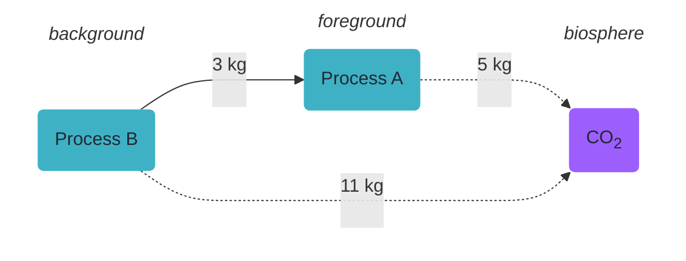
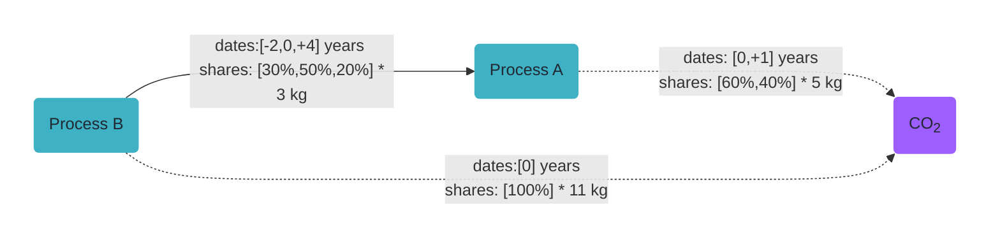
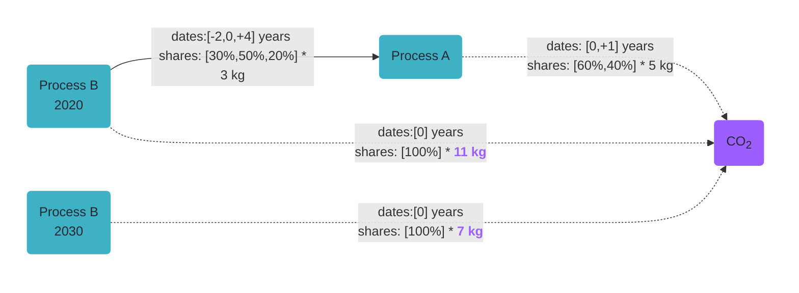

# Step 1 - Adding temporal information

To get you started with time-explicit LCA, we'll investigate this very simple production system with two "technosphere" nodes A and B and a "biosphere" node representing some CO~2~ emissions. For the sake of this example, we'll assume that we demand Process A to run exactly once.


??? note "Here's the code to set this up with brightway - but this is not essential here"

    ```python
    import bw2data as bd

    bd.projects.set_current("getting_started_with_timex")

    bd.Database("biosphere").write(
        {
            ("biosphere", "CO2"): {
                "type": "emission",
                "name": "CO2",
            },
        }
    )

    bd.Database("background").write(
        {
            ("background", "B"): {
                "name": "B",
                "location": "somewhere",
                "reference product": "B",
                "exchanges": [
                    {
                        "amount": 1,
                        "type": "production",
                        "input": ("background", "B"),
                    },
                    {
                        "amount": 11,
                        "type": "biosphere",
                        "input": ("biosphere", "CO2"),
                    },
                ],
            },
        }
    )

    bd.Database("foreground").write(
        {
            ("foreground", "A"): {
                "name": "A",
                "location": "somewhere",
                "reference product": "A",
                "exchanges": [
                    {
                        "amount": 1,
                        "type": "production",
                        "input": ("foreground", "A"),
                    },
                    {
                        "amount": 3,
                        "type": "technosphere",
                        "input": ("background", "B"),
                    },
                    {
                        "amount": 5,
                        "type": "biosphere",
                        "input": ("biosphere", "CO2"),
                    }
                ],
            },
        }
    )

    bd.Method(("our", "method")).write(
        [
            (("biosphere", "CO2"), 1),
        ]
    )
    ```

Now, if you want to consider time in your LCA, you need to somehow add temporal information. For time-explicit LCA, we consider two kinds of temporal information, that will be discussed in the following.

!!! tip "Chimaera nodes vs. separate process and product nodes"

    This model setup assumes processes are "chimaera nodes" aka. processes with a single specific reference product. However, its also possible to separate process and product nodes explicitly. For an overview of these different paradigms, see [What LCA should I do?](../decisiontree.md#modeling-paradigm-option-chimaera-vs-explicit-processproduct).

## Temporal distributions
To determine the timing of the exchanges within the production system, we add the `temporal_distribution` attribute to the respective exchanges. To carry the temporal information, we use the [`TemporalDistribution`](https://docs.brightway.dev/projects/bw-temporalis/en/stable/content/api/bw_temporalis/temporal_distribution/index.html#bw_temporalis.temporal_distribution.TemporalDistribution) class from [`bw_temporalis`](https://github.com/brightway-lca/bw_temporalis). This class is a *container for a series of amount spread over time*, so it tells you what share of an exchange happens at what point in time. So, let's include this information in our production system - first visually:


*Temporalized example production system*

??? note "Here's the code to add this information to our modeled production system in Brightway"

    ```python
    import numpy as np
    from bw_timex import TemporalDistribution
    from bw_timex.utils import add_temporal_distribution_to_exchange

    # Starting with the exchange between A and B
    # First, create a TemporalDistribution with the time information from above
    td_b_to_a = TemporalDistribution(
        date=np.array([-2, 0, 4], dtype="timedelta64[Y]"),
        amount=np.array([0.3, 0.5, 0.2]),
    )

    # Now add the temporal distribution to the corresponding exchange. In
    # principle, you just have to do the following:
    # exchange_object["temporal_distribution"] = TemporalDistribution
    # We currently don't have the exchange_object at hand here, but we can
    # use the utility function add_temporal_distribution_to_exchange to help.
    add_temporal_distribution_to_exchange(
        temporal_distribution=td_b_to_a,
        input_code="B",
        input_database="background",
        output_code="A",
        output_database="foreground"
    )

    # Now we do the same for our other temporalized exchange between A and CO2
    td_a_to_co2 = TemporalDistribution(
        date=np.array([0, 1], dtype="timedelta64[Y]"),
        amount=np.array([0.6, 0.4]),
    )

    # We actually only have to define enough fields to uniquely identify the
    # exchange here
    add_temporal_distribution_to_exchange(
        temporal_distribution=td_a_to_co2,
        input_code="CO2",
        output_code="A"
    )
    ```

## Time-specific process data

While the temporal information above tells us when the processes occur, we also need information on how our processes change over time. So, for our simple example, let's say our background process B somehow evolves, so that it emits less CO~2~ in the future. To make it precise, we assume that the original process we modeled above represents the process state in the year 2020, emitting 11 kg CO~2~, which reduces to 7 kg CO~2~ by 2030:




*Temporalized example production system with two time-specific background processes B*

??? note "Again, here's the code in case you're interested"

    ```python
    bd.Database("background_2030").write(
        {
            ("background_2030", "B"): {
                "name": "B",
                "location": "somewhere",
                "reference product": "B",
                "exchanges": [
                    {
                        "amount": 1,
                        "type": "production",
                        "input": ("background_2030", "B"),
                    },
                    {
                        "amount": 7,
                        "type": "biosphere",
                        "input": ("biosphere", "CO2"),
                    },
                ],
            },
        }
    )
    ```

So, as you can see, the processes at specific time steps reside within a separate normal
Brightway database. `bw_timex` picks these up automatically, as long as each database
says which point in time it represents:

```python
from datetime import datetime
from bw_timex import set_database_metadata

set_database_metadata("background", representative_time=datetime(2020, 1, 1))
set_database_metadata("background_2030", representative_time=datetime(2030, 1, 1))
```

You only do this once per database - it is stored in your Brightway project. Databases
exported by [premise](https://premise.readthedocs.io/en/latest/introduction.html)
**>= 2.4.9.2** bring this metadata with them, so there is nothing to do for those;
for databases from an earlier premise, set it yourself as above. The foreground doesn't
represent a specific point in time and is distributed over time instead; `bw_timex`
treats the databases holding your functional unit that way automatically.

!!! tip "Foreground split across several databases"

    Only the databases holding the functional unit become dynamic automatically. Mark
    any other foreground database yourself:

    ```python
    set_database_metadata("my_intermediate_foreground", representative_time="dynamic")
    ```

    Otherwise `build_timeline()` raises an `UnmappedDatabaseError`, naming the database
    it could not place in time.

!!! tip "Data sources"

    You can use whatever data source you want for the time-specific process data. [premise](https://premise.readthedocs.io/en/latest/introduction.html) is a nice package from the Brightway cosmos, but you can also use any custom scenario.

### Several databases for the same point in time

More than one database may carry the same date. This is useful when you modify
background processes: keep the modified copies in your own database per point in
time, instead of writing them into ecoinvent or premise.

```python
set_database_metadata("ecoinvent_2020", representative_time=datetime(2020, 1, 1))
set_database_metadata("ecoinvent_2030", representative_time=datetime(2030, 1, 1))
set_database_metadata("my_background_2020", representative_time=datetime(2020, 1, 1))
set_database_metadata("my_background_2030", representative_time=datetime(2030, 1, 1))
```

For each process, `bw_timex` interpolates only between the databases that actually
contain it, matched on `name`, `reference product` and `location`. A copy that only
exists in `my_background_2020` and `my_background_2030` is therefore sourced from
those two, while an untouched process is sourced from the `ecoinvent_*` ones.

!!! warning

    Give your copies a distinct `name`, `reference product` or `location`. If the
    same triplet occurs in two databases that share a date, `bw_timex` cannot tell
    which one you mean and raises an error. A process that exists at only some of
    the points in time is sourced from the ones it does exist at: it is interpolated
    between those, or — if it exists at only one of them — used unchanged for every
    point in time. Either way, `bw_timex` logs a warning naming the databases it used.

## Foreground exchanges that change over time

Time-specific databases capture how the *background* changes. Sometimes a *foreground*
exchange changes as well: a process becomes more efficient, so it needs less electricity
per unit of output in 2040 than it did in 2020. Rather than modelling one process per
point in time, you can give the exchange itself a trajectory (`bw_timex>0.3.4`):

```python
from bw_timex.utils import add_temporal_evolution_to_exchange

add_temporal_evolution_to_exchange(
    temporal_evolution_factors={
        datetime(2020, 1, 1): 1.0,   # 100% of the base amount in 2020
        datetime(2030, 1, 1): 0.75,  # 75% in 2030
        datetime(2040, 1, 1): 0.6,   # 60% in 2040
    },
    temporal_evolution_reference="consumer",
    input_code="B",
    input_database="background",
    output_code="A",
    output_database="foreground",
)
```

Use `temporal_evolution_amounts` instead if it's easier to state the amount directly
(`{datetime(2030, 1, 1): 45}` MJ) than as a share of the base amount — an exchange
carries either factors or amounts, not both. In between the given dates the values are
interpolated linearly; beyond them, the nearest one is kept.

`temporal_evolution_reference` picks the timestamp the trajectory is read at: the
process using the exchange (`"consumer"`) or the calendar time of the exchange itself
(`"producer"`). [What LCA should I do?](../decisiontree.md#which-temporal-evolution-reference-should-i-use)
walks through that choice.

All of this is optional: without it, exchange amounts stay constant over time. And it
applies to the foreground only — background processes evolve through the time-specific
databases above.
