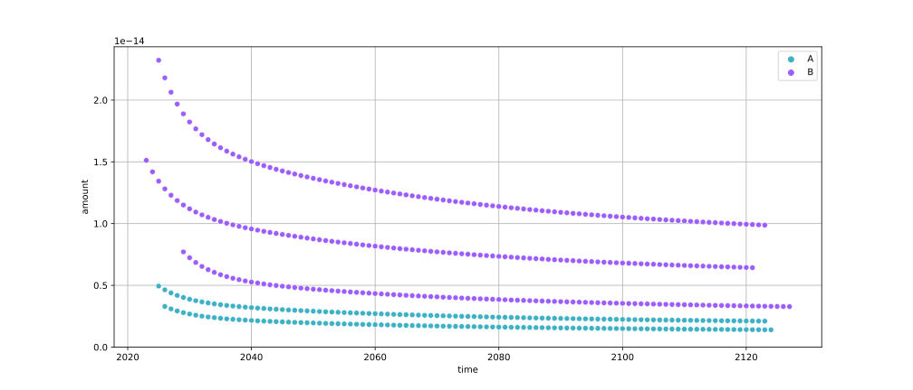
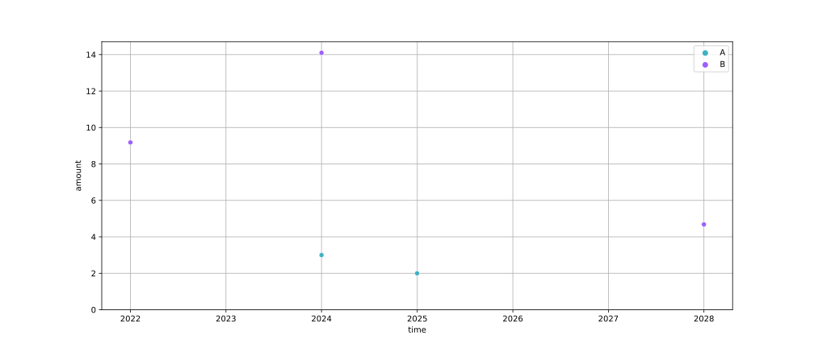

# Step 4 - Impact assessment

To characterize the time-explicit inventory, we have two options: Static and dynamic life cycle impact assessment (LCIA).

## Static LCIA
If we don't care about the timing of the emissions, we can do static LCIA using the standard characterization factors. To characterize the inventory with the impact assessment method that we initially chose when creating our `TimexLCA` object, we can simply call:

```python
tlca.static_lcia()
```

and investigate the resulting score like this:

```python
print(tlca.static_score)
```

## Dynamic LCIA
The inventory calculated by a `TimexLCA` retains the temporal information of the biosphere flows. That means that in addition to knowing which process emits what substance, we also know the timing of each emission. This allows for more advanced, dynamic characterization using characterization functions instead of just factors. In `bw_timex`, users can either use their own custom functions or use some existing ones, e.g., from the package [`dynamic_characterization`](https://dynamic-characterization.readthedocs.io/en/latest/). We'll do the latter here.

First, we need to assign characterizations function to our biosphere flows:

```python
from dynamic_characterization.ipcc_ar6 import characterize_co2
emission_id = bd.get_activity(("biosphere", "CO2")).id

characterization_functions = {
    emission_id: characterize_co2,
}
```

!!! tip "Using ecoinvent / biosphere3?"
    Then you don't need to do this. `dynamic_characterization` automatically maps the biosphere flows to matching characterization functions, so you can just skip the `characterization_functions` argument.

So, let's characterize our inventory. As a metric we choose radiative forcing, and a time horizon of 100 years:

```python
tlca.dynamic_lcia(
    metric="radiative_forcing",
    time_horizon=100,
    characterization_functions=characterization_functions,
)
```

This returns the (dynamic) characterized inventory, which shows you the radiative forcing [W/m^2^] by the CO~2~ emissions in the system over the next 100 years:

| date       | amount         | flow | activity |
|------------|----------------|------|----------|
| 2023-01-01 | 1.512067e-14   | 1    | 5        |
| 2024-01-01 | 1.419411e-14   | 1    | 5        |
| 2024-12-31 | 2.322610e-14   | 1    | 6        |
| 2024-12-31 | 4.941608e-15   | 1    | 7        |
| 2024-12-31 | 1.343660e-14   | 1    | 5        |
| ...        | ...            | ...  | ...      |
| 2124-01-01 | 1.400972e-15   | 1    | 7        |
| 2124-01-01 | 3.302104e-15   | 1    | 8        |
| 2124-12-31 | 3.294094e-15   | 1    | 8        |
| 2125-12-31 | 3.286213e-15   | 1    | 8        |
| 2127-01-01 | 3.278458e-15   | 1    | 8        |

To visualize what's going on, we can conveniently plot it with:
```python
tlca.plot_dynamic_characterized_inventory()
```
{ style="display:block;margin:0 auto" }
<br />

Of course we can also assess the "standard" climate change metric Global Warming Potential (GWP):
```python
tlca.dynamic_lcia(
    metric="GWP",
    time_horizon=100,
    characterization_functions=characterization_functions,
)
```

| date       | amount    | flow | activity |
|------------|-----------|------|----------|
| 2022-01-01 | 9.179606  | 1    | 5        |
| 2024-01-01 | 14.100328 | 1    | 6        |
| 2024-01-01 | 3.000000  | 1    | 7        |
| 2025-01-01 | 2.000000  | 1    | 7        |
| 2028-01-01 | 4.680263  | 1    | 8        |

... and plot it:
```python
tlca.plot_dynamic_characterized_inventory()
```
{ style="display:block;margin:0 auto" }
<br />

## Prospective metrics

`radiative_forcing` and `GWP` above use the IPCC AR6 characterization functions: fixed values, derived from today's atmosphere. `bw_timex` also provides three metrics whose factors instead vary by future scenario, from [Watanabe et al. (2026)](https://doi.org/10.1021/acs.est.5b01118):

| metric | unit | factors |
|---|---|---|
| `radiative_forcing` | W/m² | IPCC AR6 |
| `GWP` | kg CO₂-eq | IPCC AR6 |
| `prospective_radiative_forcing` | W/m² | Watanabe et al. (2026) |
| `pGWP` | kg CO₂-eq | Watanabe et al. (2026) |
| `pGTP` | kg CO₂-eq | Watanabe et al. (2026) |

These three need a *characterization scenario*: which IAM, SSP and RCP the factors describe. With a premise background, `iam` and `ssp` are usually derived from the `scenario` the `TimexLCA` was built with (via `bw_timex.PROSPECTIVE_IAM_MAP`), but `rcp` only derives when the premise `pathway` literally names one, e.g. `SSP2-RCP26` → `"2.6"`. Most premise pathways name a carbon budget, a policy or a warming level instead (`SSP2-PkBudg500`, `SSP2-NDC`, ...), and those never yield an RCP - so most runs need at least an explicit RCP:

```python
tlca.dynamic_lcia(
    metric="pGWP",
    time_horizon=100,
    characterization_scenario={"rcp": "2.6"},  # iam/ssp still derived from `scenario`
)
```

or the full triple, e.g. when there is no background `scenario` to derive from at all (a `TimexLCA` built from `database_dates`):

```python
tlca.dynamic_lcia(
    metric="pGWP",
    time_horizon=100,
    characterization_scenario={"iam": "IMAGE", "ssp": "SSP1", "rcp": "2.6"},
)
```

Leaving `characterization_scenario` out entirely raises rather than guessing, and the error states exactly which of `iam`/`ssp`/`rcp` did and did not derive, plus a suggested override. `bw_timex.available_scenarios()` lists which scenarios have prospective factors, which premise can build, and which support both - see the [API reference](../../api/prospective_scenarios.md).

For most of the functions we used here, there are numerous optional arguments and settings you can tweak. We explore some of them in our other [Examples](../examples/index.md), but when in doubt check out our [docstrings](../../api/index.md), which provide information also for the more advanced settings - so please browse through them as needed ☀️ 

Instead of running the whole `build_timeline()`, `lci()`, `static_lcia()` and `dynamic_lcia()` pipeline yourself, you can also take the short route through a simple `.run`-call, as described under [Configured Runs & Scenario Comparisons](configured_runs.md).