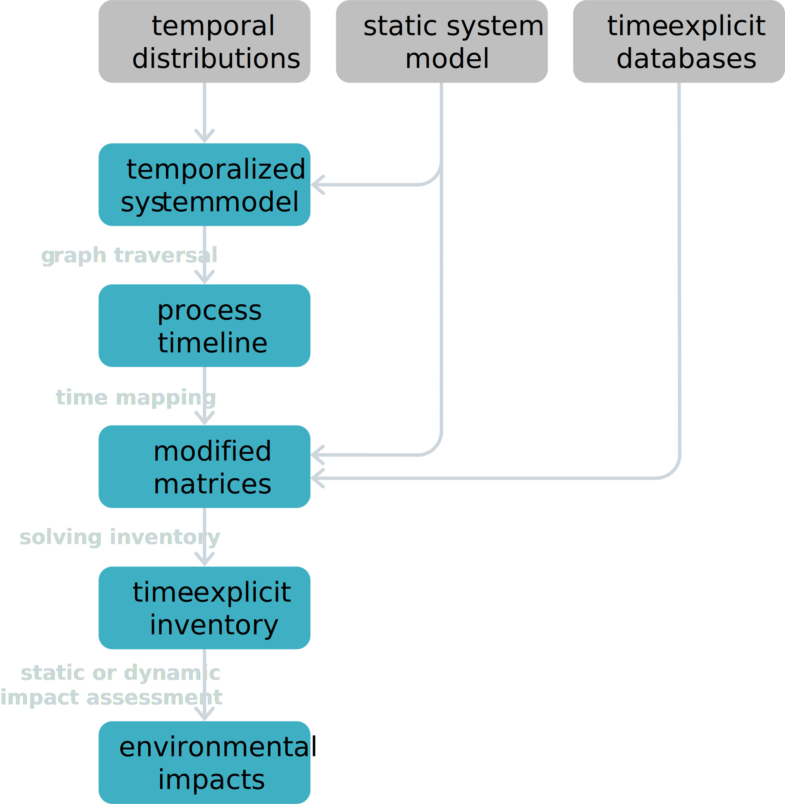
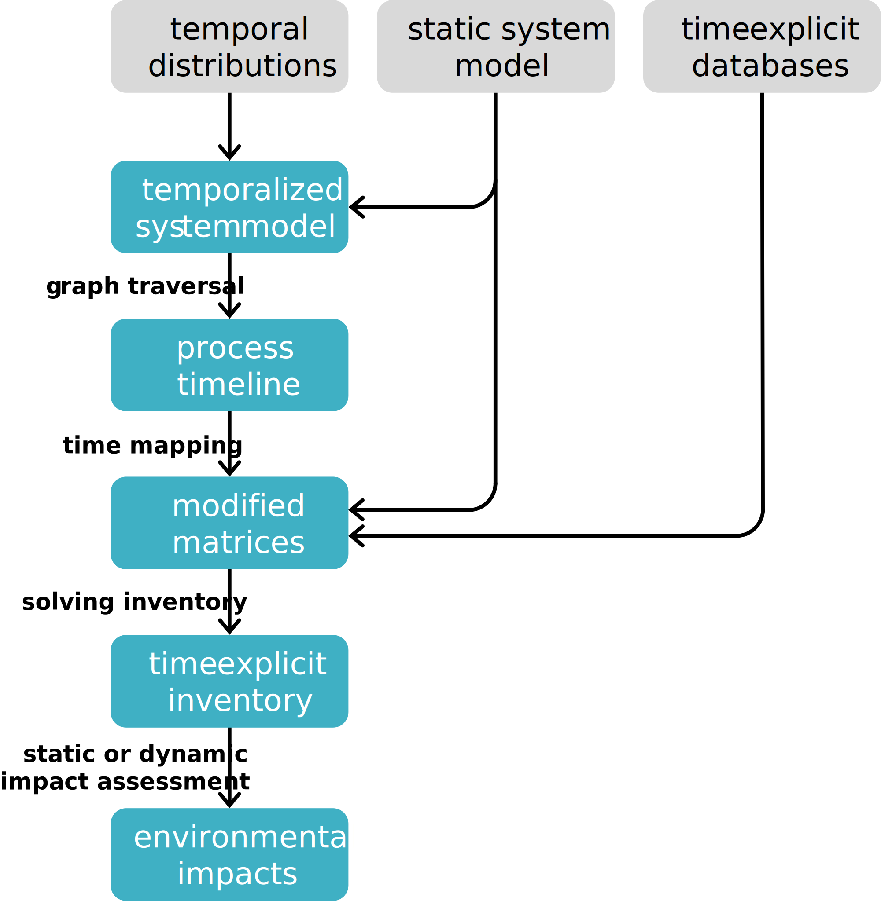

Theory
========

This section explains some of the theory behind ``bw_timex``. Check out the flow chart below for a quick overview of how it all comes together, and you'll find more detailed explanations of each step in the following subsections.

User input 
----------------

``bw_timex`` requires 3 inputs:
 
1. a static foreground system model with
2. temporal information using the attribute ``temporal_distribution`` on technosphere or biosphere exchanges in the foreground system modeel, and 
3. a set of background databases, which must have a reference in time.

.. dropdown:: ℹ️ More info on inputs

    - The foreground system must have exchanges linked to one of the background databases. These exchanges at the intersection between foreground and background databases will be relinked by ``bw_timex``.
    - Temporal distributions can occur at technosphere and biosphere exchanges and can be given in various forms, see `bw_temporalis <https://github.com/brightway-lca/bw_temporalis/tree/main>`__, including absolute (e.g. 2024-03-18) or relative (e.g. 3 years before) types and can have different temporal resolution (down to seconds but later aggregation supports resolutions down to hours).
    - Temporal distributions are optional. If none are provided, no delay between producing and consuming process is assumed and the timing of the consuming process is adopted also for the producing process.

Graph traversal
----------------
``bw_timex`` uses the graph traversal from `bw_temporalis <https://github.com/brightway-lca/bw_temporalis/tree/main>`__ to propagate the temporal information along the supply chain. The graph traversal is priority-first, following the most impactful node in the graph based on the static pre-calculated LCIA score for a chosen impact category. 
All input arguments for the graph traversal, such as maximum calculation count or cut-off, can be passed to the ``TimexLCA`` instance.

By default, only the foreground system is traversed, but nodes to be skipped during traversal can be specified by a ``edge_filter_function``. 
At each process, the graph traversal uses convolution to combine the temporal distributions of the process and the exchange it consumes into the resoluting combined temporal distribution of the upstream producer of the exchange.

Process timeline
----------------
The graph traversal returns a timeline that lists the time of each technosphere exchange in the temporalized foreground system. 
Exchanges that flow from same producer to the same consumer within a certain time-window (``temporal_grouping``, default is 'year') are grouped together. 
This is done to avoid countless exchanges in the timeline, as the temporal distributions at exchange level can have temporal resolutions down to seconds while one may not have a similar temporal resolution for the databases. 
We recommend aligning ``temporal_grouping`` to the temporal resolution of the available databases.

 Let's consider the following system: a process A that consumes an exchange b from a process B, which emits an emission X and both the exchange b and the emission X occur at a certain point in time. 
 

 .. image:: data/example_ab_dark.svg
    :class: only-dark
    :height: 300px
    :align: center

 .. image:: data/example_ab_light.svg
    :class: only-light
    :height: 300px
    :align: center

 |
 The resulting timeline looks like this:

 +-------+-----------+----------+-----------------+
 | time  | producer  | consumer | amount          |
 +=======+===========+==========+=================+
 | 0     | A         | n/a      | 1               |
 +-------+-----------+----------+-----------------+
 | 0     | B         | A        | 2 * 0.2 = 0.4   |
 +-------+-----------+----------+-----------------+
 | 1     | B         | A        | 2 * 0.8 = 1.6   |
 +-------+-----------+----------+-----------------+

Time mapping
----------------
Based on the timing of the processes in the timeline, ``bw_timex`` matches the processes at the intersection between foreground and background to the best available background databases.
Available matching strategies are closest database or linear interpolation between two closest databases based on temporal proximity. The new best-fitting background producer(s) are mapped on the same name, reference product and location as the old background producer.

Modified matrices
------------------
.. _`bw_processing`: https://github.com/brightway-lca/bw_processing?tab=readme-ov-file
``bw_timex`` now modifies the technopshere and biosphere matrices using ``datapackages`` from `bw_processing`_.

Technosphere matrix modifications:
~~~~~~~~~~~~~~~~~~~~~~~~~~~~~~~~~~

1. For each temporalized process in the timeline, a new process copy is created, which links to its new temporalized producers and consumers. The timing of the processes is stored in the ``activity_time_mapping_dict``, which maps the process ids to process timing.
2. For those processes linking to the background databases, ``bw_timex`` relinks the exchanges to the new producing processes from the best-fitting background database(s). 

Biosphere matrix modifications:
~~~~~~~~~~~~~~~~~~~~~~~~~~~~~~~
Depending on the user's choice, two different biosphere matrices are created: 

1. If ``TimexLCA.lci()`` is executed, the 'static' biosphere matrix is expanded, by adding the original biosphere flows for the new temporalized process copies. With this, static LCI with inputs from the time-explicit databases are calculated and stored in ``TimexLCA.lca.inventory``.
2. If ``TimexLCA.lci(build_dynamic_biosphere=True)`` is executed, a 'dynamic' biosphere matrix is created, which next to the links to LCI from the time-explicit databases also contains the timing of emissions. ``build_dynamic_biosphere=True`` is the default, so it has to be set to ``False`` to skip this step. The matrix ``TimexLCA.dynamic_inventory`` and the more readable dataframe ``TimexLCA.dynamic_inventory_df`` contain the emissions of the system per biosphere flow including its timestamp and its emitting process.

 For the simple system above, a schematic representation of the matrix modifications looks like this:

 .. image:: data/matrix_dark.svg
    :class: only-dark

 .. image:: data/matrix_light.svg
    :class: only-light

Static or dynamic impact assessment
-----------------------------------
``bw_timex`` allows to use conventional static impact assessment methods, which are executed using ``TimexLCA.static_lcia()``. 

To take advantage of the detailed temporal information at the inventory level, dynamic LCIA can be applied, using ``TimexLCA.dynamic_lcia()``. Users can define or import their own dynamic LCIA functions.
Out of the box, we provide dynamic LCIA functions for the climate change metrics 'radiative forcing' and 'global warming potential (GWP)' for all greenhouse gases in the `IPCC AR6 report Chapter 7 Table 7.SM.7 <https://www.ipcc.ch/report/ar6/wg1/chapter/chapter-7/>`_.

The time horizon ``time_horizon``, over which both metrics are evaluated, defaults to 100 years, but can be set flexibly in years.
Additionally, both metrics can be applied with a fixed or flexible time horizon. Fixed time horizon means that the all emissions are evaluated starting from the timing of the functional unit until the end of the time horizon, meaning that later emissions are counted for shorter,
and flexible time horizon means that each emission is evaluated starting from its own timing until the end of the time horizon.
The former is the approach of `Levasseur et al. 2010 <https://pubs.acs.org/doi/10.1021/es9030003>`_. This behaviour is set with the boolean ``fixed_time_horizon``.

.. note::  
    *Work in progress*. ``bw_timex`` *is under active development and the theory section might not reflect the latest code development. When in doubt, the source code is the most reliable source of information.* 

